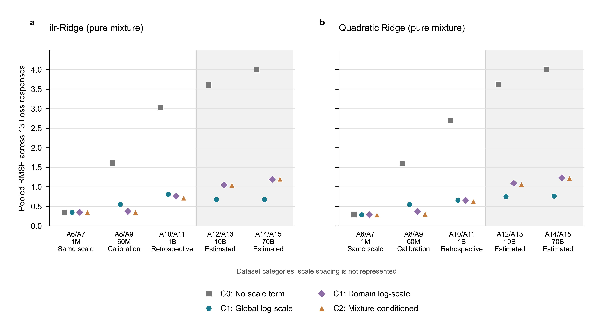

# 第三问补充实验：纯配比、规模修正与可选质量增量

`task_id: T-Q1-S03-ABLATION` · `run_id: q1-mixture-scale-ablation-20260925-r01` · 待团队复核

本实验直接以配比为主变量，回答两个问题：纯配比模型接入规模修正后是否改善；在完整配比表示之外加入 Q_proxy 是否仍有稳定收益。它是前期交接的补充实验，不将质量分数作为建模前提。

- [论文方法与结果中文素材](docs/decisions/q1-mixture-scale-ablation-results.md)
- [运行说明与复现命令](experiments/runs/q1-mixture-scale-ablation-20260925-r01/README.md)
- [纯配比性能表 CSV](experiments/runs/q1-mixture-scale-ablation-20260925-r01/table_pure_mixture_scale.csv) · [LaTeX 表格片段](experiments/runs/q1-mixture-scale-ablation-20260925-r01/table_scale_transfer.tex)
- [质量增量及配对区间 CSV](experiments/runs/q1-mixture-scale-ablation-20260925-r01/table_optional_quality.csv) · [LaTeX 表格片段](experiments/runs/q1-mixture-scale-ablation-20260925-r01/table_quality_increment.tex)
- [图表、源数据及中文图注](experiments/runs/q1-mixture-scale-ablation-20260925-r01/figures/README.md)

主要发现：纯二阶配比模型+C1-global 在 1B 回顾评价上的 pooled RMSE/MAE 为 **0.6575/0.4256**，无需 Q 即可获得尺度修正收益；C2 的同表 RMSE 更低（0.6252），但 MAE 更高（0.5207），且在 10B/70B 估算表上的误差更大。本次固定参数协议没有支持二阶模型加入 Q_proxy 后具有稳定增益。

A4/A5 拟合基模型；A6/A8 同配方差拟合修正；A10 为已查看过的回顾评价；A12–A15 为已见配方的给定估算 Loss。此实验没有产生新的真实大规模训练数据。

