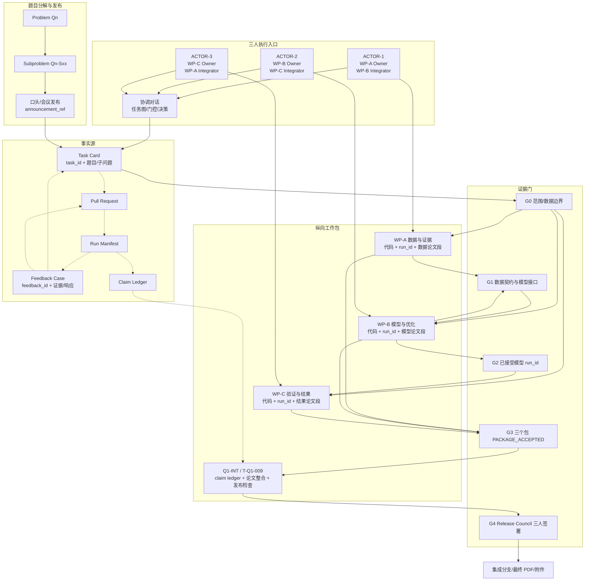

# 全流程架构图 v2

本图描述题目/子问题拆分、口头发布、三条纵向工作包、反馈回链、证据门和最终 Release Council。图源保存在 `architecture-flow.mmd`。

## 阅读顺序

先看 Owner—Peer Reviewer—Integrator 的环形分工，再看 G0–G4 门控。WP-B 的模型规格和 WP-C 的脚手架可以在 G0 后并行准备；正式分析结果必须等待 G2。只有三个工作包全部 `PACKAGE_ACCEPTED`，Q1-INT 才能整合 claim ledger 和最终论文。
