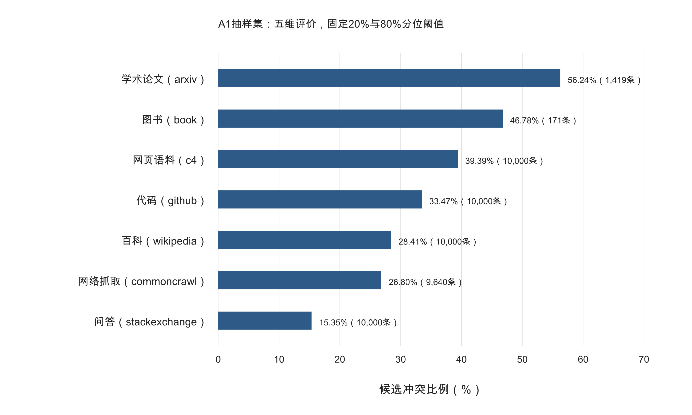
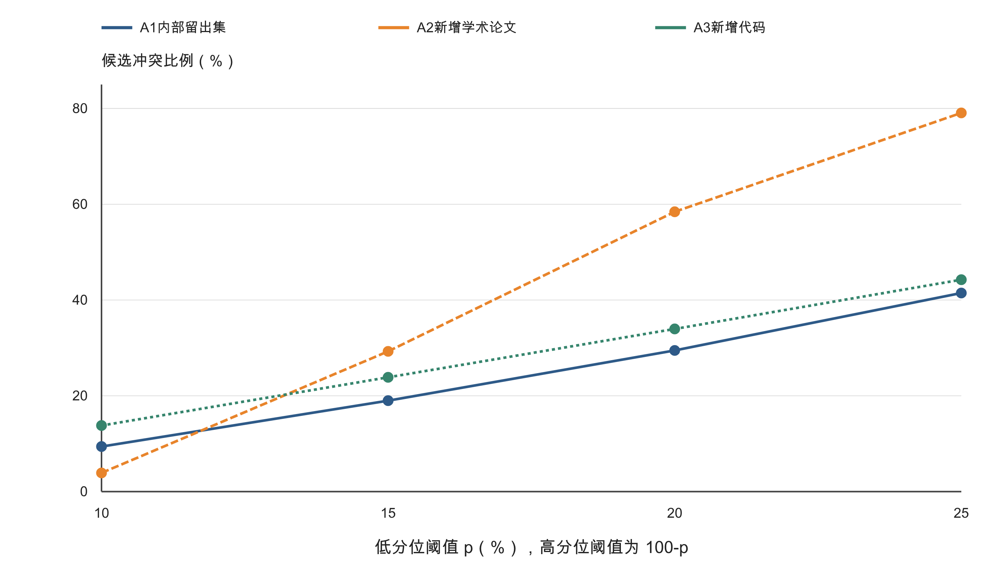
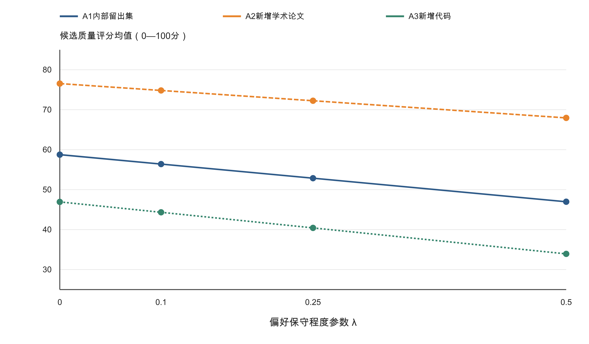

# 问题一第二小问 质量冲突定义 消解与扩展检验

本报告交付冲突定义、成因诊断、综合评价候选模型及抽样/扩展检验。执行角色为 WP-C / ACTOR-3，覆盖 T-Q1-005～008。当前结果属于探索性试算，上游 G2 与独立审核记录缺失，不能作为 PACKAGE_ACCEPTED 结论直接并入正式论文。已有计算可复核，正式 bootstrap 与权重扰动实验按任务卡留待 G2 通过后运行。

## 1 数据与第一问衔接

A1、A2、A3 分别为 51230、17523、203752 条记录。全量 272505 条，去重 261086 个 ID；跨文件重复 11419 条，其 16 项归一化指标及领域一致。A1 按既有 SHA256 ID 规则划分为 fit 40919 条、holdout 10311 条。A2 与 A1 重叠 1419 条，新增 16104 条；A3 重叠 10000 条，新增 193752 条。它们来自相同数据体系，新增部分不能称为独立真值。

已有交付未包含逐样本分数，因此使用原始质量信号和第一问冻结参数复算。A1 质量均分 60.947131，全量去重 54.232264；七个 A1 领域均分最大核对误差小于 1e-12。选定 16 项指标本次无非有限值，无填补或删行。其他方向未决指标不纳入本次模型。唯一 ID 分数先计算后按样本数聚合，扩展集不重新拟合归一化。

## 2 冲突定义与严格划分

总分相同不代表评价结构相同；单一总分不足以判断冲突。设统一方向的指标为 \(x_{ij}\in[0,1]\)，原权重为 \(w_j\)。将通用指标组织为五维：内容价值（FineWeb教育价值、QuRating教育价值及事实与常识）；表达质量（英语流畅度、可读性及写作风格）；整洁度；无广告程度；非重复程度（独特词比例和两个反向高频词组指标）。事实与常识评分不是事实准确率。

组内分数及组权重为

\[
z_{ig}=\frac{\sum_{j\in G_g}w_jx_{ij}}{\sum_{j\in G_g}w_j},\qquad
v_g=\frac{\sum_{j\in G_g}w_j}{\sum_{h=1}^{5}\sum_{j\in G_h}w_j}.\tag{1}
\]

五维仅使用 11 项指标。DSIR 三项、无字母词比例、句末标点比例保留在第一问原分数和全指标敏感性对照中，不自动删除源指标。将其排除于五维候选模型是任务适用性假设，不代表已证明这些指标无效。组内平均可能掩盖分歧，因此同属性评分器另行诊断。

从 A1 fit 得到 \(l_g=P_{20}(z_g)\)、\(h_g=P_{80}(z_g)\)，冻结后应用于其他分区。定义

\[
H_i=\{g:z_{ig}>h_g\},\quad L_i=\{g:z_{ig}<l_g\},\quad
I_i=\mathbf1\{H_i\ne\varnothing,\ L_i\ne\varnothing\}.\tag{2}
\]

取严格不等式，边界并列值留在中间。该定义表示相对评价的实质对立，不是经统计检验确定的显著性，更不是缺陷真值。四类为：H、L 均非空的候选冲突；仅 H 非空的相对优势；仅 L 非空的相对短板；H、L 均空的中间状态，四类互斥且穷尽。

表1 五维阈值与组权重

| 维度 | 低阈值 | 高阈值 | 组权重 |
| --- | --- | --- | --- |
| 内容价值 | 0.2783 | 0.5613 | 0.2499 |
| 表达质量 | 0.3578 | 0.7702 | 0.2836 |
| 整洁度 | 0.2673 | 0.9884 | 0.1090 |
| 无广告程度 | 0.5244 | 0.9004 | 0.1056 |
| 非重复程度 | 0.6366 | 0.7838 | 0.2519 |

定义强度和广度

\[
u_{ig}=\left[\frac{z_{ig}-h_g}{1-h_g}\right]_+,\quad
b_{ig}=\left[\frac{l_g-z_{ig}}{l_g}\right]_+,\quad
C_i=\max_g u_{ig}\max_g b_{ig},\quad
B_i=\frac{|H_i||L_i|}{\binom52}.\tag{3}
\]

同一维度不可能同时在两端，所以 C 的乘积来自不同维度。C 是超阈幅度，不是概率；B 是冲突维度对占全部维度对的比例。

## 3 成因分类与证据边界

同属性测量分歧：FineWeb与QuRating教育价值各取A1 fit的高低分位，识别一高一低。A1有415条（0.8101%），全量去重1402条（0.5370%）。不同属性权衡：内容价值高而广告信号强、整洁度高而非重复程度低。尺度/方向冲突：低分位只能表示相对低，不能自动等同语义缺陷。领域/语言适用性：自然语言流畅度及格式代理对代码、外语、LaTeX可能不适用。缺失与非有限值：本次16项入模指标未发现，不能据此推广至所有原始字段。域漂移与同源重复：按领域和新增/重叠分区报告，不能以总体变化替代域内变化。优化不稳定：固定CRITIC–TOPSIS与闭式候选模型没有随机优化器，不虚构收敛失败或训练seed效应。

本次阅读15个定向典型样本，不能用它们估计误判率。恐龙百科应用推广文本 BkiUdN05qdmDHWQtq2MC 的原分68.5862，内容价值0.8986、无广告0.0262，支持内容价值与推广性质并存。能源法案条目 BkiUdAE5qhLA90Q4aFWN 的非重复程度0.2470，反复出现机构全称，可能是必要复述。加泰罗尼亚语条目 BkiUbJ_xK6mkyCfOAMU9 整洁度0.9998而表达质量0.3443，提示语言适用性问题。数学论文 BkiUctrxK7FjYHGHzffr 的两种教育分为0.2192和0.7693，但五维聚合未标冲突，说明不能省略组内诊断。成因均为待核验解释，不声称因果识别完成。

广告专项对照：相对高内容价值/低无广告分在A1命中1884条；换成原始广告logit大于无广告logit，只剩310条（0.6051%）。margin=0对应归一化0.298274，而低分位门槛为0.524358。分类器判别也并非人工广告真值。

## 4 冲突消解的综合评价候选模型

消解的对象是综合决策中的补偿规则，不是强行抹平真实差异。原分 \(Q_i^{(0)}\) 与冲突证据均保留。对组内评分器分歧不擅自判定谁正确；对语言/领域适用性疑点输出复核标记。对真实属性权衡，提出偏好权重不确定集合下的有限补偿模型，作为提交给WP-B的候选，不覆盖既有评分接口。

令 \(\Delta_5=\{p:p_g\ge0,\sum_gp_g=1\}\)，构造

\[
\mathcal W_\lambda=\{(1-\lambda)v+\lambda p:p\in\Delta_5\},\quad
Q_i^{\mathrm{cand}}(\lambda)=100\min_{a\in\mathcal W_\lambda}\sum_ga_gz_{ig},\quad0\le\lambda\le1.\tag{4}
\]

由于线性目标在单纯形上将不确定权重放到最小维度，得到

\[
M_i=\sum_gv_gz_{ig},\quad m_i=\min_gz_{ig},\quad
Q_i^{\mathrm{cand}}(\lambda)=100[(1-\lambda)M_i+\lambda m_i].\tag{5}
\]

因此

\[
100m_i\le Q_i^{\mathrm{cand}}(\lambda)\le100M_i,\qquad
Q_i^{\mathrm{cand}}-100M_i=-100\lambda(M_i-m_i).\tag{6}
\]

\(\lambda\)表示对维度偏好不确定性的保守程度，不是由人工标签估计的最优参数。取0.25仅作为展示点，比较0、0.1、0.25、0.5。固定非负权重时，每个维度上升都不会降低M和m，故候选分单调；其范围为0～100，各维度同为c时得分100c。闭式解已与五个顶点枚举核对。这种方法对所有样本连续应用，不依据离散冲突标签突然扣分，也不因为某个优点变强、冲突强度上升而降低总分。

与原16维TOPSIS的分差混合了指标集合、聚合方式及保守程度三个变化，不能全部称为“消解效果”。因此单列五维加权平均基线，只有式(6)可归因于有限补偿参数。得分变低不证明质量评价更准确。本模型仍继承指标适用性问题，正式采用前须原文标注或下游效果验证。

## 5 抽样与扩展结果

表2 冲突覆盖结果

| 分区 | 样本数 | 候选冲突数 | 候选冲突率% |
| --- | --- | --- | --- |
| A1_full | 51230 | 15124 | 29.5218 |
| A1_holdout | 10311 | 3039 | 29.4734 |
| A2_overlap | 1419 | 798 | 56.2368 |
| A2_new | 16104 | 9408 | 58.4203 |
| A3_overlap | 10000 | 3347 | 33.4700 |
| A3_new | 193752 | 65795 | 33.9584 |
| union_unique | 261086 | 90327 | 34.5966 |

A1四类数量依次为15124、14958、14439、6709。A1 fit冲突率29.5340%，holdout为29.4734%；相近仅表示本次划分下规则分布接近，不是准确率。arxiv在A1中为56.24%，新增为58.42%；github在A1中为33.47%，新增为33.96%。其他五域无新增验证，book仅171条。A2新增中整洁度高/非重复程度低占54.53%；A3新增中非重复程度高/整洁度低占26.27%。

将全量域级冲突率按A1领域比例重加权得29.6680%。全量34.5966%相对A1的增加，按该分解顺序主要来自构成变化，而不是各域普遍变差。详细分解保存在composition_decomposition.json。

表3 候选综合评价结果（lambda=0.25）

| 分区 | 原TOPSIS均分 | 五维加权均分 | 候选稳健均分 | 相对五维基线变化 |
| --- | --- | --- | --- | --- |
| A1_full | 60.9471 | 58.6944 | 52.8212 | -5.8733 |
| A1_holdout | 61.0370 | 58.7548 | 52.8643 | -5.8905 |
| A2_new | 63.4735 | 76.5370 | 72.2455 | -4.2915 |
| A3_new | 51.6887 | 46.9338 | 40.4316 | -6.5022 |
| union_unique | 54.2323 | 51.0674 | 44.8250 | -6.2424 |

表4 候选分的排序关系（Spearman与排名百分点变化）

| partition | rank_correlation_original | rank_correlation_core | rank_shift_ge_10pp_vs_core |
| --- | --- | --- | --- |
| A1_holdout | 0.9206 | 0.9838 | 0.0551 |
| A2_new | 0.6105 | 0.9731 | 0.1013 |
| A3_new | 0.9487 | 0.9783 | 0.1032 |
| union_unique | 0.9507 | 0.9862 | 0.0500 |

arxiv新增相对原TOPSIS的相关仅0.6105，提示改变指标集合与聚合规则会实质改变排序，不能把候选模型称为原模型的小幅修正。github去掉表达质量与整洁度的替代适用性场景均分50.1591，而五维候选均分40.4342；该差异说明适用性假设重要，但不能据此自动剔除两个维度。替代场景仅作模型建议附件。

## 6 敏感性与验证边界

表5 相对阈值敏感性（%）

| tail_probability | A1_holdout | A2_new | A3_new |
| --- | --- | --- | --- |
| 0.1000 | 9.4074 | 3.8934 | 13.7919 |
| 0.1500 | 18.9894 | 29.2784 | 23.8604 |
| 0.2000 | 29.4734 | 58.4203 | 33.9584 |
| 0.2500 | 41.4606 | 79.0673 | 44.2380 |

领域间排序随阈值改变，不能声称单一冲突率或领域排序稳健。16项逐指标、去DSIR的13项、核心11项、五维聚合的A1冲突率分别为63.32%、60.41%、56.44%、29.52%；变化反映候选机会数量和分组作用，不是较低比例等于更好。

已完成原评分复算、重复ID核对、四类穷尽性、候选模型范围/单调性/顶点解核对和图表视觉检查。真实数据bootstrap、随机权重扰动及抽样对排名反转尚未运行：角色卡要求G2后执行，而源包没有PACKAGE_ACCEPTED和独立审核记录。相应脚本已实现并通过合成接口测试，不能把接口测试当作数据结论。

正式验证脚本设计为三seed、各200次、领域分层的条件行bootstrap；冻结已拟合参数，仅度量给定样本集合下的重采样波动，不覆盖拟合不确定性、源文档聚类或采样偏差。权重扰动为各权重乘以1+Uniform(-epsilon,epsilon)，重新归一化，epsilon为0.1和0.2，每seed20次。排名反转使用随机文本对，排除自身与并列，报告可比较对数；它不同于排名位移超过10个百分点。固定模型无随机训练，seed仅控制重采样和扰动。

已另生成83条未标注分层核验清单，包含冲突和非冲突样本。人工字段保持为空，未编造标签、置信区间、准确率或因果结论。

## 7 输出与角色交接

逐文本结果包含ID、数据分区、原总分、五维分、冲突类别/强度/维度、教育评分器分歧、广告分类器标记、复核标记、候选分及差值。数据CSV中的rate均为0～1；原分与候选分为0～100；排名位移为0～1百分位差。结果均分是先逐文本评分后按样本数聚合。sample_results.csv.gz按唯一ID保存；record_index.csv.gz保留全部文件成员关系，可恢复overlap/new分区。

项目角色卡要求WP-C由ACTOR-3执行、ACTOR-1独立复核、ACTOR-2集成检查。本包不代签、不登记为已接受论文主张、不覆盖上游模型、不生成虚假的最终PDF或Git提交。G2缺口、模型建议及角色验收状态已登记feedback与handoff。

## 数据依据

数据依据为桌面 real_attachments 的 A1–A3、第一问 normalization_stats.json、model_parameters.json 及 domain_scores.csv。原始压缩文件的哈希记录在本包数据清单中。本文的分组和稳健聚合为明确提出的候选模型，不冒用外部文献结论。CRITIC–TOPSIS 公式沿用上游已保存规格；本包未重新估计上游权重。
