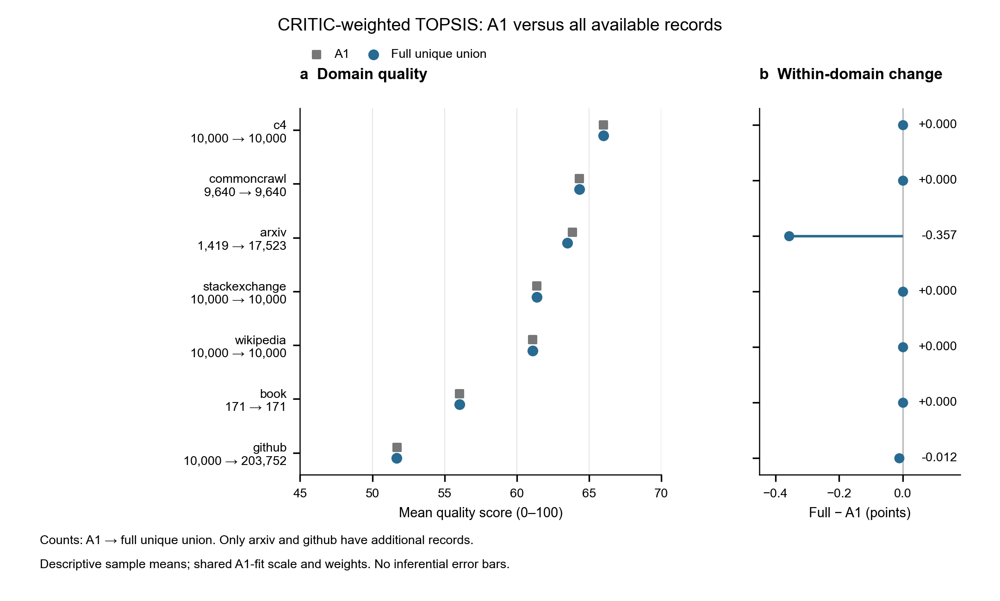

> 团队提交状态：既有本地计算的待审报告；G1、独立复核和集成检查未完成，不是已接受的论文结论。预处理候选与复现入口见根目录 README-delivery.md。

# 问题一第一小问：CRITIC–TOPSIS 数据质量评价报告

日期：2026-09-24。历史提交角色：B；当前审核分工以 `docs/tasks/WP-B-delivery.yml` 为准。主运行：`q1-critic-topsis-20260924-r01`。状态：计算与复核完成，待团队审核。本文落实用户选定的 CRITIC 赋权＋TOPSIS 评分模型，不预设团队已经验收。

## 1. 本报告回答的问题

对 A1、A2、A3 所有记录的质量信号进行方向统一和预处理，在选定的 16 个指标上计算样本质量分，再形成领域和语料质量分，并对照 A1 与全量结果。采用的是既有实验 `TOPSIS_CRITIC` 的固定理想点、加权距离版本。其他方法仅作为对照或敏感性分析。

全部 272,505 条记录均完成评分；跨文件有 11,419 条重复记录，核对其领域与 16 个归一化指标一致后，联合语料保留 261,086 个唯一 ID。主模型 A1 语料均分为 **60.9471**，全量去重语料均分为 **54.2323**。这是选定代理指标下的综合指数，不是人工标注准确率或下游训练收益。

## 2. 数据覆盖与评价对象

| 数据集 | 全部记录数 | 与 A1 重叠 | 相对 A1 新增 | 用途 |
|---|---:|---:|---:|---|
| A1 | 51,230 | — | — | 固定划分为 fit 40,919 与 holdout 10,311 |
| A2（arxiv） | 17,523 | 1,419 | 16,104 | 应用 A1 fit 参数，分重叠与新增子集报告 |
| A3（github） | 203,752 | 10,000 | 193,752 | 应用 A1 fit 参数，分重叠与新增子集报告 |

A2 包含 A1 的全部 arxiv 样本；A3 包含 A1 的全部 github 样本。A2/A3 不能整体当作独立来源真值。其余五个领域仅有 A1 数据，均分不变代表没有新增样本，不代表完成了这些领域的外部验证。book 只有 171 条样本。

“全量”指所有记录均使用；22 个原始质量字段可形成 25 个候选标量，其中 16 个按当前约定入模，另 9 个方向未决，保留为空列，不把它们填零或静默纳入模型。所有 16 个入模指标都是样本级指标；领域与语料分由样本得分聚合。

## 3. 预处理与方向约定

FineWeb 取单元素值；流畅性与无广告信号取对应正、负类别的 logit 差；整洁度与可读性将六类 logit 作 softmax 后计算 0–5 级期望；QuRating 保留独立语义分量。原始字节保持不变。

A1 以 seed=20260923 的固定 ID 哈希规则划分：SHA256(seed + '|' + id) 前 8 字节按大端整数取模 100，0–79 为 fit，80–99 为 holdout。只有 fit 估计变换参数与 CRITIC 权重。

令方向系数 s_j 为正向 +1、负向 −1，y_ij=s_j x_ij。用 A1 fit 的 y 的 1% 和 99% 分位数 L_j、U_j 作固定缩放：

```text
z_ij = clip((y_ij - L_j) / (U_j - L_j), 0, 1)
```

边界相同时定义为 0.5。A1 holdout、A2、A3 不重新拟合尺度。选定 16 项本次全部有效，没有填补或删行；若以后任一入模指标缺失，评分入口会报错，要求显式修订缺失策略。

三个负向指标是无字母词比例、最高频词二元组字符占比、最高频词三元组字符占比。负向是本次噪声/重复代理假设，并非任何领域都严格“越低越好”：数学、表格、代码及合理重复可能受不适当惩罚。DSIR 是指定目标域亲和度，也不是普适质量真值。新增指标方向说明及去三负向、去 DSIR 对照已随包提供。

## 4. 主模型公式

### 4.1 CRITIC 赋权

在 A1 fit 的 16 维归一化矩阵上，计算样本标准差（ddof=1）与 Pearson 相关系数：

```text
I_j = sigma_j * sum_k(1 - r_jk)
w_j = I_j / sum_l I_l
```

权重非负、和为 1。常数列获得零权重；所有信息量均为零时中止。CRITIC 中的相关性项反映指标间统计冗余程度，不等于题目第二小问的逐文本指标冲突定义或消解。

| 指标 | 原始方向 | CRITIC 权重 |
| --- | --- | --- |
| 教育价值（FineWeb） | 正向 | 6.1487% |
| 流畅性 margin | 正向 | 6.8928% |
| 整洁度期望 | 正向 | 8.0008% |
| 可读性期望 | 正向 | 7.6401% |
| Books 目标亲和度 | 正向 | 4.2564% |
| Wikipedia 目标亲和度 | 正向 | 4.1670% |
| 数学目标亲和度 | 正向 | 4.2954% |
| 写作风格 | 正向 | 6.2939% |
| 事实与常识 | 正向 | 5.8322% |
| 教育价值（QuRating） | 正向 | 6.3703% |
| 无广告 margin | 正向 | 7.7530% |
| 独特词比例 | 正向 | 6.8619% |
| 无字母词比例 | 负向 | 4.9398% |
| 最高频二元词组占比 | 负向 | 5.8624% |
| 最高频三元词组占比 | 负向 | 5.7762% |
| 句末标点行比例 | 正向 | 8.9093% |

### 4.2 TOPSIS 样本评分

本版本取固定正理想点 (1,…,1)、负理想点 (0,…,0)，在已经统一尺度的 z 上计算：

```text
D_i+ = sqrt(sum_j w_j * (1 - z_ij)^2)
D_i- = sqrt(sum_j w_j * z_ij^2)
Q_i  = 100 * D_i- / (D_i+ + D_i-)
```

权重在平方距离中出现一次，等价于按 sqrt(w_j) 缩放坐标。没有再次按各数据集做向量归一化，也没有按各数据集的极值重选理想点。常见的先乘 w_j 再取普通欧氏距离会形成 w_j²，本包将其单独列为敏感性版本。该方法是明确约定的 CRITIC 加权距离 TOPSIS，不混称所有 TOPSIS 实现都相同。

Q 在 0–100 之间；在固定非负权重下，提高任意一个方向已统一的指标不会降低 Q。分数不是概率，未设置高、中、低质量分级阈值。

## 5. 从样本到领域、语料的聚合

```text
领域均分 Q_d = sum_(i in d) Q_i / n_d
语料均分 Q_corpus = sum_d (n_d / N) * Q_d
```

联合语料先按 ID 去重，再按样本数加权。A1、A2、A3 各文件的结果仍保留全部记录，另列 A2/A3 overlap 和 new_only。先评分再聚合；TOPSIS 是非线性的，不把领域平均指标送入 TOPSIS 当作领域均分。领域等权宏平均只作补充，不替代按样本数加权的语料均分。本流程无需聚类。

## 6. 域级结果与 A1 对照

| 领域 | A1 样本数 | A1 均分 | 全量去重样本数 | 全量均分 | 全量−A1 | 全量排名 |
| --- | --- | --- | --- | --- | --- | --- |
| arxiv | 1,419 | 63.8624 | 17,523 | 63.5050 | -0.3574 | 3 |
| book | 171 | 56.0325 | 171 | 56.0325 | +0.0000 | 6 |
| c4 | 10,000 | 66.0021 | 10,000 | 66.0021 | +0.0000 | 1 |
| commoncrawl | 9,640 | 64.3357 | 9,640 | 64.3357 | +0.0000 | 2 |
| github | 10,000 | 51.7014 | 203,752 | 51.6893 | -0.0121 | 7 |
| stackexchange | 10,000 | 61.3879 | 10,000 | 61.3879 | +0.0000 | 4 |
| wikipedia | 10,000 | 61.1009 | 10,000 | 61.1009 | +0.0000 | 5 |

七个领域的均分排名在 A1 与全量之间保持一致。arxiv 变化 −0.3574 分，github 变化 −0.0121 分。新增子集结果详见运行目录 `tables/extended_vs_A1.csv`。



图中每个点是该领域全部有效样本的均分，左轴注明 A1→全量样本数；右面板直接显示域内变化。数据具有同源重叠，因此本图不作为两组独立样本显著性检验，不附虚构置信区间。

## 7. 为什么语料总体均分下降

全量与 A1 的总体差为 -6.7149 分。将全量各域均分按 A1 领域占比重新加权，得到 60.9349 分。按此明确的分解次序，域内变化部分为 -0.0123 分，领域构成变化部分为 -6.7026 分。全量 github 占比大幅增加，且在本模型中该域均分较低，因此不能把整体均分下降直接解释为各域数据质量普遍下降。领域等权宏平均为 60.5791，仅是另一种汇总口径。

## 8. 本次重跑的对照与敏感性

| 模型/方案 | 全量均分 | 与主模型 Spearman | 排名差≥20百分点的比例 |
| --- | --- | --- | --- |
| CRITIC–TOPSIS（主模型） | 54.2323 | 1.000000 | 0.000% |
| CRITIC 加权和 | 55.4638 | 0.999041 | 0.000% |
| 16 指标等权加权和 | 58.7839 | 0.987743 | 1.185% |
| 去掉三个负向指标 | 50.1027 | 0.967390 | 2.778% |
| 去掉三个 DSIR 指标 | 50.5676 | 0.985995 | 0.948% |
| 距离中使用权重平方 | 52.1870 | 0.995843 | 0.134% |

去三负向、去 DSIR 方案将相应主权重置零并归一化，不重新估计剩余指标权重。20 个百分点是描述模型排序分歧的操作阈值，不是质量指标冲突的统计显著性标准。不同模型平均分尺度不同，不能按平均分高低判定模型更好。去掉三个负向指标后有约 2.78% 样本达到此排名分歧阈值，提示方向假设需要在领域案例中进一步核验。

本次共实际运行六个独立编号的方法/敏感性方案。既有 13 配置比较和 PP-GA 权重塌缩证据作为历史附录保留，并未声称重新训练了所有旧模型。

## 9. 复核、复现与限制

- 5 项模型性质测试通过：端点、单调性、固定参照、错误输入、常数列。
- 23 项独立核对通过：全量覆盖、去重、协方差法复算 CRITIC、逐行复算 TOPSIS、聚合对账、输入输出哈希与历史结果比较。
- 与此前 TOPSIS_CRITIC 的最大绝对差为 2.4242×10⁻⁹，来源于归一化 CSV 的保存精度差异，不影响本报告四位小数结果。
- 本次重建了 002 缺失的矩阵，用新 run_id、新 manifest 完成可核验来源链。旧清单哈希不一致的历史原因尚未判定，旧文件保存在 reference 中，未伪造或覆盖旧运行记录。
- 旧预处理脚本中部分漂移摘要使用前 5,000 个有效值；此限制已登记。评分、权重拟合、域级结果以及本包的归一化边界占比表均覆盖对应分区全部记录。
- 固定 A1 分位数会截断扩展数据中的极端信号，TOPSIS 不能恢复截断信息。
- 尚无人工质量标签、下游训练收益验证或抽样 bootstrap 区间。模型一致性不代表真实性，数值复核不代表质量有效性验收。
- 指标冲突成因和冲突消解属于第二小问，本报告不将模型分歧分析冒充其完成结果。

运行命令和输入要求见包根目录 README-delivery.md；完整样本数据位于 data/processed/ 与各 run/artifacts/，不进入公开 Git 包。汇总表、代码、配置、运行记录、图和本报告放入 Git 提交候选包。当前 ACTOR-3 独立复核与 ACTOR-1 集成检查尚未完成。

## 10. 方法与指标来源

- CRITIC：Diakoulaki 等，Determining objective weights in multiple criteria problems: The CRITIC method，https://doi.org/10.1016/0305-0548(94)00059-H。
- 质量信号定义：https://github.com/togethercomputer/RedPajama-Data#summary-of-quality-signals。
- 噪声及重复启发式的适用范围参考 Gopher 附录：https://arxiv.org/pdf/2112.11446。该文网页语料过滤规则不能直接证明本数据所有领域的单调质量方向。
- 本实验固定理想点、距离权重约定和聚合规则以本报告公式及 configs/q1-score-baselines.yaml 为准。

附加来源核对：新建 q1_X_norm_v2.csv 的字节 SHA256 与旧 manifest 登记的缺失矩阵哈希完全一致；因此已恢复该矩阵内容。其他四项旧元数据文件的历史哈希差异仍保留反馈，新运行的全部产物使用一致的新清单。
