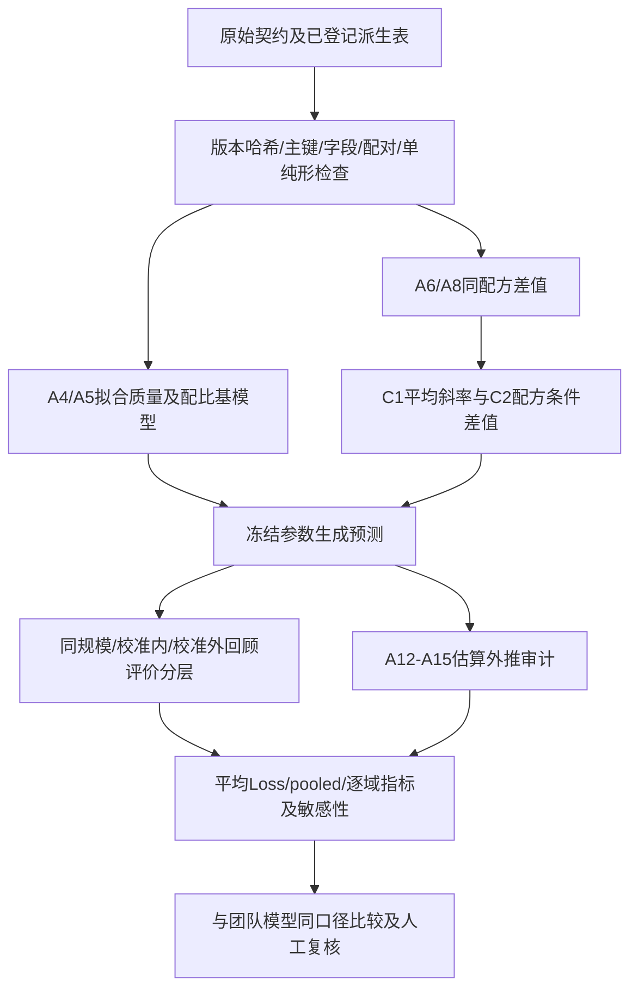

# 第三问：数据、模型和计算流程

这是团队研究资产与本地补充实验的交接指南。当前工程目标是预测 17 域配比、规模标签及候选质量轴对应的 13 个 Loss，并分析影响及迁移边界。工程校准允许改变部分检验数据的角色，但须记录实际用途，不能把同一数据同时称为校准集和独立检验集。

## 1. 可用数据

| 数据 | 行数 | 规模标签 S | 可支持的分析 | 本次校准路线用途 |
|---|---:|---|---|---|
| A4/A5 | 512 | 1M | 配比—Loss 拟合、内部模型比较 | 拟合 B1、M1 基模型 |
| A6/A7 | 256 | 1M | 同规模新配方评价 | 同规模基模型评价；与 A8/A9 配对校准 |
| A8/A9 | 256 | 60M | 与 A6 完全同配方的规模差异 | 规模项校准；校准内误差单列 |
| A10/A11 | 64 | 1B | 配方和规模联合变化 | 未参与本次系数拟合的回顾性评价 |
| A12/A13 | 63 | 10B | 已见配方在更大规模的估算结果 | 外推表一致性审计 |
| A14/A15 | 63 | 70B | 同上，且与 A12 配方相同 | 外推表一致性审计 |
| A16 | 17 个配方域的映射 | 不适用 | direct / near-direct / inferred 关系 | 质量映射来源与覆盖率 |
| A1–A3 派生质量域分数 | 依版本 | 不适用 | 构造可选质量轴 | 复用冻结派生值，不重新读取样本全文 |

总计 1,214 行。A6=A8；A12=A14，且为 A4 前 63 个配方。数据对内按 `index` 连接，跨表计算配对差必须核验配方后按相同顺序转为数组，不能直接用不同 DataFrame 行索引相减。A12–A15 的 Loss 是估算值，不能用于证明真实大模型预测已经验证。

规模 S 沿用附件标签，不从标签额外推断参数量、实际训练 token 数或计算量。`S*p_i` 若另行生成，只是按比例分配的期望量，不是独立测量。

复现输入直接引用仓库已有的 [v1 hard 组合表](../../experiments/runs/quality-mapping-20260925-r02-soft-handoff/tables/scored_wide_v1_hard.csv)。v2 soft 表同目录可用于后续质量映射敏感性，**本次数值没有使用 v2**。原始来源和哈希见 [q1_raw.yaml](../../data/manifests/q1_raw.yaml)，本次精确输入版本见新运行 manifest。

## 2. 字段与质量版本

- 主键：`dataset,index`；`scale` 为规模标签；`loss_observed` 区分真实表与估算表。
- `p_*`：17 域配比，检查非负并逐行归一化；保存原始和检查。带截距的线性模型只使用 16 个独立坐标，或用 ilr 对数比坐标并登记零替换规则。
- `metric/the_pile_*_val_loss`：13 个交叉熵响应；均值 Loss 取这 13 域等权，不代表题目指定了唯一总体权重。
- `nih_exporter/enron_emails/europarl/philpapers` 无同名 Loss；只能分析其配方替代关联，不能虚构直接响应。
- `quality_score_proxy_0_1`：v1 推断映射代理，含 inferred 域假设。
- `quality_score_mapped_0_1`：v1 direct/near-direct 覆盖部分归一化后的质量；A4 中 5 行无覆盖而缺失，拟合时明确排除，不填成零质量。
- `mapped_share_direct_near_direct`：映射质量权重覆盖，不是样本可信概率。

本地 v1 的 0–1 候选质量轴来自 A1–A3 排名归一化与聚类映射，不等于团队 canonical CRITIC–TOPSIS 的 0–100 域分数。不能将二者模型名称合并。`Q_proxy=sum(p_i q_i)` 是配比的确定性线性函数；并列加入 p 后 Ridge 可进行预测收缩，但不能识别独立质量因果效应。A16 中 direct/near-direct 仅覆盖 6/17 个域，另外 11 域推断的不确定性仍在。

## 3. 模型的分工

团队既有模型与结果入口见 [模型资产索引](q1-s03-team-model-inventory.md)，包括 ilr-OLS、ilr-Ridge、PLS、二阶 Ridge、浅层 GBDT、部分质量增量、多规模交互和领域替代效应。**本地 B1 不能被称为这些模型中的全局最优模型。**

本次复核模型：

| 模型 | 公式／定义 | 参数估计 |
|---|---|---|
| B1 透明质量基线 | `f_j(p,Q)=a_j+gamma_j Q(p)` | A4/A5；规模列为常数，无法估计规模斜率 |
| M1 一阶配比增量 | `f_j=a_j+gamma_j Q+beta_j^T p_1:16` | A4/A5；Ridge；proxy λ=100、mapped λ=10 为历史冻结值 |
| C0 | `Lhat_j=f_j` | 不加规模项 |
| C1_global | `Lhat_j=f_j+c*x` | 配对差在行和目标上平均得到 c |
| C1_domain | `Lhat_j=f_j+c_j*x` | 每个目标分别估计 c_j |
| C2（单位修复版） | `Lhat_j=f_j+x/log10(60)*dhat_j(p)` | 用 A6/A8 配对差训练 Ridge；配对内部五折选择 λ |

其中 `x=log10(S/1M)`，`c_j=mean[L_j(p,60M)-L_j(p,1M)]/log10(60)`。当 S=1M 时修正为零；当 S=60M 时必须还原拟合的完整配对差。历史 C2 漏除分母，旧“外推失败”结论撤回；历史 C3 还有折内均值使用问题，本次不将它升级为可用主模型。

C1_global 与 C1_domain 对**13 域平均预测**相同，但逐域误差不同。不能用前者或均值指标的改善证明后者在每个领域都准确。

## 4. 处理架构

## 5. 指标与证据

主指标 RMSE/MAE 均越低越好。必须先定义计算对象：

1. **mean-response**：每行先将 13 个实际 Loss 和预测 Loss 分别平均，再计算误差，可能抵消域间误差。
2. **pooled**：在全部 `n×13` 残差上计算 RMSE/MAE；与团队 benchmark 的总体误差口径相同。
3. **target-macro RMSE**：13 个目标各自 RMSE 的均值，与 pooled RMSE 通常不同。
4. **逐域**：每个目标的 RMSE/MAE、偏差、R²、Spearman。

R²越高越好；负值表示比该表响应均值参照更差。按用户决策不围绕 R² 优化，但保留其诊断；不能因为 RMSE 相对旧基线降幅大就忽略绝对误差或域间抵消。C1 在同一规模只是常数平移，不改变样本排序。Bootstrap 区间只反映对配对行重采样的估计变异，不包括函数形式、映射、训练和尺度迁移的全部不确定性。

A10/A11 虽未参与本次系数拟合，已在研究中多次查看，称校准外回顾性评价；A12–A15 称估算表审计。团队 [规模迁移量检查](../decisions/q1-scale-shift-transfer-results.md) 显示低规模斜率预测 10B→70B 降幅 0.6936，表内实际降幅为 0.3829。因此不能宣称常数对数斜率在任意规模成立。

## 6. 已覆盖与尚待完成

已覆盖：配比约束、同尺度预测、配比与规模混杂、质量轴敏感性、配对规模校准、校准外和估算表误差。团队已有二阶候选和替代效应稳定性分析，本次提供入口，不能再说团队尚未分析组合效应。

待完成：统一质量版本和目标权重后做全模型同口径比较；将非线性规模曲线作为新协议另立运行；对稳定的领域替换和组合效应给出有限支持范围；取得独立规模或新配方实测验证。当前数据不能证明因果效应、通用尺度律或最终最优配方。
