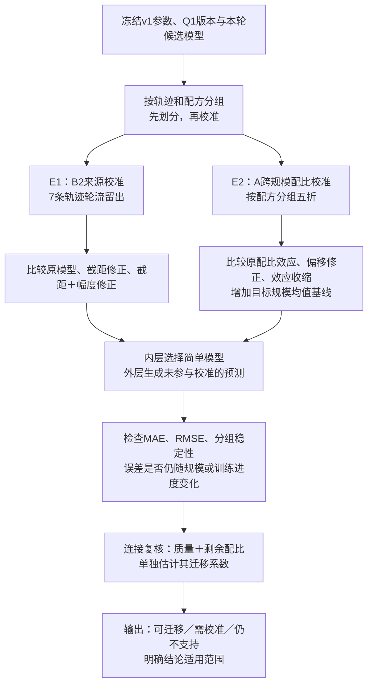

> 历史研究记录：保留原阶段结论与时态。当前结果、版本关系和交付状态见 [研究总览](../research/q2/README.md)。

# 问题二连接假设与迁移改善探索计划

状态：计划已确定并完成数据结构核对，尚未运行本计划中的新校准实验。基准模型为 `q2-model-finalization-20260925`。本轮只探索 B2 来源校准与 A 跨规模配比校准，不新增大规模训练，不更改 Q1 评分，不反向拟合情景预测。

## 1. 两个实验回答的问题

- **实验 E1：B2 来源校准。** 已知 B1 幂律迁移到 B2 存在大误差；检验误差主要能否由来源截距和整体幅度差解释，并在未参与校准的模型轨迹上得到改善。
- **实验 E2：A 跨规模配比校准。** 检验 1M 学到的配比效应能否通过规模特定截距与效应收缩迁移到 60M、1B；再检验这套处理是否也改善实际的质量＋剩余配比连接。

二者检验的是可校准性与局部连接假设。成功不等于 Q1 到 B 质量映射已经经验标定，也不等于完整联合模型已经通过真实实验验证。

## 2. 实验流程图

外层测试只用于评价。任何内层模型选择、目标来源偏移和幅度估计都不得使用对应外层测试标签。若看到外层结果后增加模型，新模型属于后续探索，不冒充本计划的预设结果。

## 3. 已核对的数据结构

| 数据 | 可用记录 | 分组和用途 |
|---|---:|---|
| B2 | 1029行，7条轨迹，每条147行 | 参数规模为0.111、0.256、0.590、1.300、2.700、6.700、13.000B；一条轨迹的全部检查点必须同组 |
| A4/A5，1M | 512个不同配方 | 冻结既有配比模型，不用验证配方重新估计底层系数 |
| A6/A7，1M | 256个不同配方 | 与A8/A9配方一一对应；用于排序和尺度变化诊断 |
| A8/A9，60M | 256个不同配方 | 可按配方分成校准集和测试集 |
| A10/A11，1B | 64个不同配方 | 与A6/A8没有相同配方；单独进行目标规模校准验证 |

配方一致性核对基于归一化17维配比、保留10位小数。正式生成划分时先核查近重复，不只依赖行号。A4/A5与上述检验配方没有同配方重合。

A信息从Q1桥接输出读取，主目标为每配方13域平均Loss，不能与“13个域各自拟合后平均误差”混用。B2为半合成数据，所有结果保留其性质标签。

## 4. E1：B2来源校准

冻结 B1 幂律预测 `z=L_B1(N,D)`，不重新拟合五个幂律参数。

| 候选 | 预测式 | 含义 |
|---|---|---|
| B0 | `z` | 无目标源标签、直接迁移 |
| B1c | `z+b` | 仅调整目标来源截距 |
| B2c | `a+c*z`，`c≥0` | 调整截距和幅度，保持原预测方向 |
| Bmean | 目标来源校准集的Loss均值 | 检查使用规模曲线是否优于简单基线 |

校准参数先使用平方误差最小化；正幅度边界命中0时，报告模型退化为常数。B2c不等于重新估计幂律指数。

**划分：**外层留一轨迹，共7折；其余6条轨迹用于校准和内层留一轨迹选择。内层以每条轨迹等权的MAE选择候选，候选MAE差异不超过较好者的5%时优先自由参数更少的模型。这是事先设置的简洁性规则，不是统计显著性阈值。

**评价：**逐轨迹MAE、RMSE、R²、平均有符号误差，以及等权宏平均。最小/最大参数轨迹单独报告，区分规模插值和端点外推；13B还略超出B1参数范围。对残差随log N、log D或检查点变化的结构做描述，不根据其图形临时调参。

**后续小样本敏感性（主校准有效后再做）：**固定各候选形式，在每个外层折的6条可用轨迹中，分别选1、2、4条作校准来源，枚举这些规模组合；只评价外层那条轨迹。不同校准子集不是独立重复实验，汇总为误差范围和中位数，不把子集数量当作样本量或用来挑最好一次划分。

若B1c改善而B2c没有稳定额外收益，保留截距；若B2c在留出轨迹上进一步改善，说明需要幅度校准；若两者均失败，报告简单来源校准不足，暂不自动升级到新模型族。

## 5. E2：跨规模配比效应校准

固定A4/A5模型，记训练平均Loss为 `μ₁`，中心化配比效应为 `f(p)`，使其训练均值为0。对目标规模 `s=60M` 和 `s=1B` 分别比较：

| 候选 | 预测式 | 含义 |
|---|---|---|
| A0 | `μ₁+f(p)` | 原始1M模型直接迁移 |
| A1c | `a_s+f(p)` | 校准整体偏移，固定效应幅度 |
| A2c | `a_s+λ_s*f(p)`，`λ_s≥0` | 校准偏移及配比效应幅度 |
| Amean | `a_s` | 目标规模校准集均值基线 |

`λ_s<1`是否成立由估计决定，不预设必须收缩；`λ_s>1`也如实报告。若约束解为0，不声称存在正向配比迁移。

**划分：**配方分组五折，种子`20260925`。60M每折约204/205个配方用于校准、51/52个用于测试；1B每折约51/52个校准、12/13个测试。内层在校准配方上四折选择，采用同样MAE及5%简洁性规则。1M与60M同配方必须绑定外层折；1M观测Loss只用于同配方诊断，不作为目标测试预测的输入。

**评价：**主指标为目标规模原始Loss的外层MAE、RMSE，并报告相对A0、A1c和Amean的改善。Spearman反映排序；中心化RMSE只作事后形状诊断，不能拿测试均值校准部署预测。正幅度缩放不会改变配方排序，因此不期待仅用A2c改善Spearman。

**后续小样本敏感性（主校准有效后再做）：**从每个外层校准集固定抽取8、16、32个配方，使用预设5个随机种子（20260925至20260929），各候选均评价所有重复。外层测试配方不变，不选取误差最小的一次抽样作为结论；这些重复也是敏感性分析而非新的独立实验。

**实际连接复核：**底层配比迁移改善后，还要用同一外层划分比较

- `a_s+g(T(Q_A))`；
- `a_s+g(T(Q_A))+F_remaining(p)`；
- `a_s+g(T(Q_A))+λ_s*F_remaining(p)`。

这里`g`、`T`、配比残差化规则均冻结在v1，`g`按参考质量中心化。仅用每折校准集重新估计该分支的`a_s、λ_s`。不能把完整配比模型的λ直接套到剩余配比项。TOPSIS为既定候选主轴，soft完整单列，不根据目标测试分数更换主轴。

这一检验在A的Loss口径内进行，保留A来源截距，不验证B1绝对Loss与A绝对Loss一致。

## 6. 预设判断规则

阈值用于本轮探索决策，不是比赛硬性标准，也不是统计显著性结论。

| 判断 | E1 | E2 |
|---|---|---|
| 实用改善 | 外层宏平均MAE较B0下降至少10%，RMSE不恶化 | 目标规模外层MAE较A0下降至少10%，RMSE不恶化 |
| 超过简单校准 | 与B1c、Bmean比较额外收益；近似持平则选简单模型 | 与A1c、Amean比较；优于原模型却不优于Amean时，不能宣称配比迁移成功 |
| 稳定性 | 至少5/7条轨迹较未校准模型改善；报告最差轨迹 | 至少4/5折较未校准模型改善；报告λ的折间范围 |
| 连接获得局部支持 | 支持B1曲线到B2的局部校准，不支持A/B质量映射 | 校准后的质量＋剩余配比分支在留出配方上也优于无剩余配比分支 |

报告原始配对误差差值。必要的不确定性描述按完整轨迹或配方组重采样，不按检查点独立抽样。B2仅7条轨迹，其区间只能谨慎作探索性描述。历史上这些数据已被多次检查，嵌套分组验证能约束本轮拟合泄漏，但不能将它们重新称为从未查看过的最终独立测试集。

## 7. 输出与停止边界

计划输出目录：`experiments/runs/q2-transfer-improvement-20260925/`。

1. 分组划分清单、版本、输入指纹和预设候选配置。
2. 每条外层测试记录的原始值、预测值、模型名、校准规模和折号。
3. 按来源/规模/轨迹汇总的误差对照及校准系数。
4. 少量目标数据敏感性表。
5. 结论表：无需校准可用、目标来源校准后可用、当前模型仍不支持；说明是否能反馈更新组合模型。

仅在外层结果支持时提出更新v1；本轮保留v1文件，建立独立探索运行。不加入B8，不拿B10估算Loss拟合，不把情景预测回填观测。若简单校准失败，保留负面结果及下一步最小候选，不无限增加复杂模型直到取得好成绩。

即使两组实验均改善，跨A/B的质量刻度标定和完整联合实验验证仍未完成。最终要分别报告“零目标样本迁移”“目标来源有校准样本时的迁移”和“新规模完全没有校准样本的外推”，不能混为一谈。
