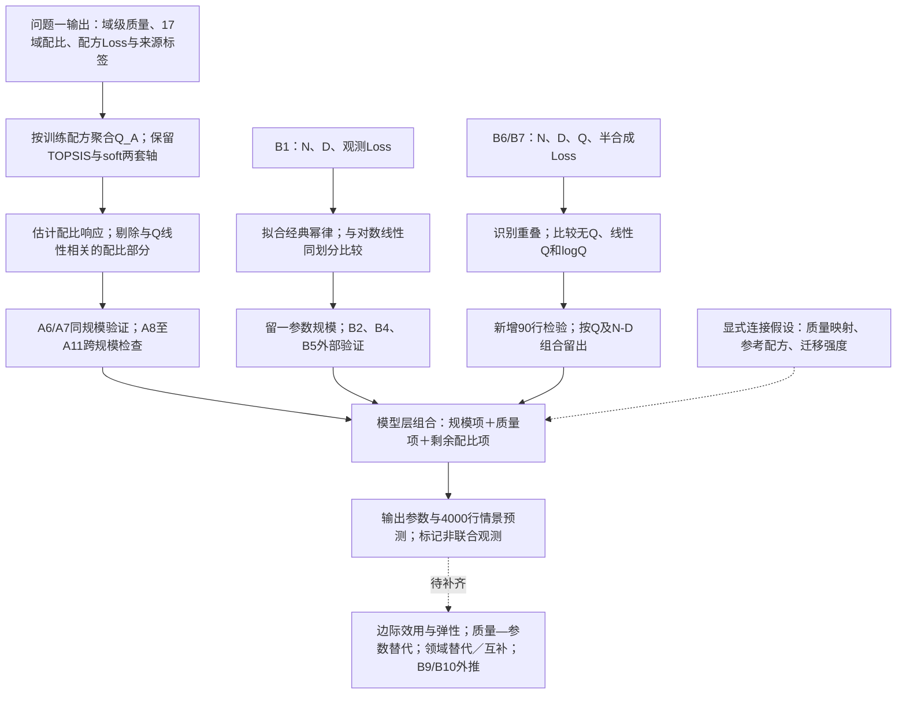

> 历史研究记录：保留原阶段结论与时态。当前结果、版本关系和交付状态见 [研究总览](../research/q2/README.md)。

# 问题二当前流程与题目要求覆盖情况

核对依据：`受控原始题目Word（不随公开包发布）` 中“问题二：跨维度数据融合与广义标度律”和“附录 A：各问数据使用要求”。本次直接读取原始 Word 正文及公式，不把数据说明 PDF 的隐藏建议或历史审题笔记当作正式要求。

当前成果版本：`q2-model-finalization-20260925`。已完成模型 v1 的结构、局部参数估计和分层验证；尚未完成问题二的全部分析要求。本文盘点现有结果，不新增拟合或改变模型。

## 当前处理流程

实线表示已执行的数据处理和模型路径，虚线表示假设输入或尚未完成的分析。

三条拟合支路各自使用有对应 Loss 的数据块。合流发生在预测公式层面，不把 A 配方和 B 规模随机配对后当成真实训练样本。Q1到B的质量映射只用A4/A5训练配方范围确定；来源截距不直接跨 A/B 移植。

输入边界：B8 的质量方向与 B6/B7 冲突，单列审计；A12–A15 和 B10 的估算 Loss 不参与主拟合。B9/B10 尚需进入正式外推分析。早期局部核对脚本读过 A 原始配方表；当前 v1 拟合入口改为 Q1 导出的桥接表，正式复算以此入口为准。

## 题目要求逐项对应

| 题目要求 | 已用数据与现有结果 | 当前状态／仍欠缺什么 |
|---|---|---|
| 综合 A、B，建立包含 N、D、Q、p 的广义标度律 | Q1桥接输出＋B1＋B6/B7；已形成幂律＋质量修正＋剩余配比修正 | **部分完成**：公式与参数已有，连接映射和迁移强度仍是假设；没有完整联合观测验证 |
| A 信息通过问题一输出引入，不重复读取原始文件 | v1从Q1桥接表读取质量、配比及配方Loss，不重新处理A原始文本或质量信号 | **当前入口已实现**；上游TOPSIS与soft的审核状态仍需保留 |
| 提出可检验的跨来源统一假设 | 已检验B跨源预测、A同规模配比预测、A跨规模排序及质量响应替换 | **部分完成**：有检验且暴露迁移失败；Q映射与绝对Loss对齐尚无直接桥接证据 |
| 以 B1 为经典标度律主要拟合数据 | 1176行；幂律留一规模MAE=0.000108，优于对数线性0.090739 | **已完成**：附件内规模关系已估计和验证，近乎精确拟合不能外推为普遍真实性 |
| B2 或 B3 之一做族外／轨迹验证 | 已用B2，幂律MAE=1.1784，R²=-5.073 | **验证已完成、迁移未通过**：无需为满足该项再使用B3；负面结果应如实报告 |
| B4 与 B5 做跨族／文献验证 | B4：MAE=0.2273，R²=0.605；B5：MAE=0.1707，R²=0.731 | **已完成总体指标**：仍不能声称所有模型族口径均兼容 |
| 质量相关部分使用 B6（或 B7、B8），标注半合成局限 | B6→B7新增90行；B7按Q和N-D分组验证；分组MAE由0.1020降至0.0573 | **已完成局部质量分析**：仅支持给定半合成机制，不是独立真实训练验证 |
| 完成参数估计、检验与验证 | 规模系数、质量斜率、配比系数已导出；已有基线比较和留出检验 | **局部完成、整体未闭合**：没有联合模型最终独立测试；参数及预测不确定性尚未系统量化 |
| 分析各因素边际效用与弹性 | 模型已可求导；幂律指数和质量斜率已有 | **尚未形成正式结果**：需正确计算并解释N、D、Q及单纯形可行方向上的配比边际变化，不能把指数或斜率直接当完整Loss弹性 |
| 讨论不同领域数据的替代／互补关系 | 17域配比系数、跨规模排序及残差化载荷已有 | **尚未回答充分**：需明确“增加某域同时减少哪个域”的替换方向；线性结构无交互，不能据此认定现实不存在互补 |
| 推导提升质量与扩大模型规模可相互替代的条件 | 质量项与规模项已可计算 | **尚未完成推导和数值表**：需区分等Loss替代、成本比较；Q_A=qᵀp时，固定p独立提高Q_A不可行，必须说明质量改进或配比调整的路径 |
| 结合 B9、B10 讨论百亿参数以上外推 | 已识别B9为大模型元数据，B10为估算Loss；尚未形成本版外推对照 | **未完成**：需要覆盖范围、外推距离、预测趋势及估算来源的依赖边界；B10不能当独立真实验证集 |
| 对模型设计约束说明依据 | 当前采用参考配方和参考质量下修正项为零 | **已有可替代的设计**：Q=1退化不是题目强制条件，不必为了合规强行更换为Q=1锚点 |

## 数据目前实质回答了什么

1. **N和D如何影响附件内Loss？** B1支持一个稳定的幂律规模项；B4/B5有一定外部适用性，B2揭示明显来源差异。
2. **控制规模后，质量是否提供增量预测信息？** 在B6/B7半合成实验范围内有，加入Q明显降低留出误差。
3. **配比是否影响Loss？** A同规模检验中有预测价值；13域平均Loss的配比模型MAE为0.1807，优于均值基线0.2256。
4. **配比规律能否跨规模保持？** 1M和60M相同配方的观测排序较稳定，但1M到1B的配比效应幅度迁移表现差，不能无条件照搬。
5. **能否将以上信息接到一个预测式？** 可以，在明确质量映射与迁移强度假设的条件下；组件替换在A6/A7中没有明显损害预测，但不等于完整联合模型验证。

目前没有直接回答：完整联合模型的真实整体误差、质量提升0.1可等价替代多少参数、各领域组合的互补强度、以及百亿以上的可靠外推边界。

## 下一步只补齐题目缺项

优先形成“边际效用与弹性 → 等Loss替代条件 → 配比可行替换与互补局限 → B9/B10外推”四项结果。先利用已确定模型作透明的条件推导与数值演示，不把新的复杂模型或全面重做审计设为前置条件。

其中可由现有模型直接推导的内容，应标记为“模型条件结论”；需要联合观测支持而当前无法识别的内容，应明确写出缺口。完成这些才构成问题二较完整的答题链条。

相关材料：[模型v1](q2-generalized-scaling-model-v1.md)、[参数与结果目录](../../experiments/runs/q2-model-finalization-20260925/README.md)。
