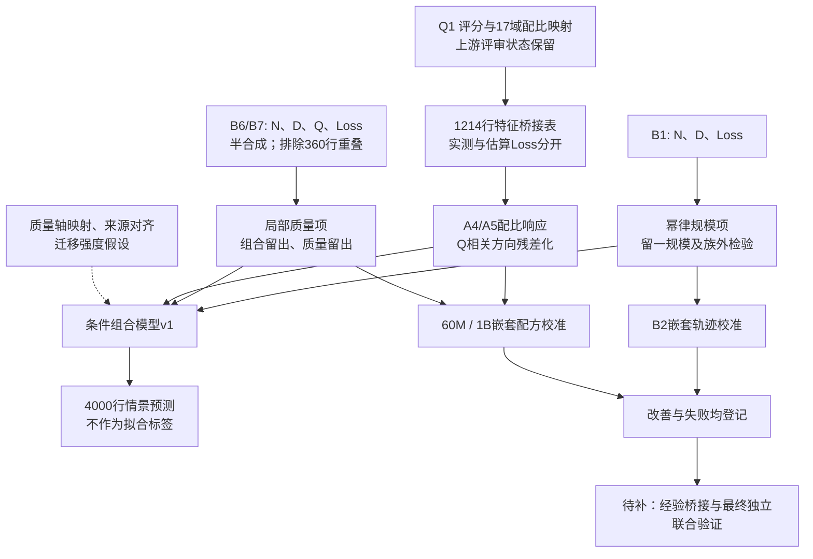

# 问题二研究交付总览

状态：**研究归档与复现完成，待独立评审；完整 A—B 联合模型尚未验证。** 本包整理既有研究，不新增拟合结论，也不改变已合并的 Q1 输入及团队 Q2 审计。

入口：[研究过程](process.md) · [结果与证据](results.md) · [数据说明](data.md) · [复现说明](reproduce.md) · [交接与待办](handoff.md) · [文件级目录](file_inventory.csv)

## 当前回答

我们建立了一个包含规模 N、训练量 D、质量 Q 和配比 p 的**条件模型**：B1 估计规模项，B6/B7 估计质量项，Q1 导出的 A 配方表估计配比响应，再通过显式映射假设组合。桥接表不是 A、B 同一实验的联合观测表；模型预测没有回填为真实 Loss。

| 检验 | 主要结果（MAE） | 可支持的结论 |
|---|---|---|
| B1 留一参数规模 | 幂律 0.000108；对数线性 0.090739 | 附件内规模规律拟合较好 |
| B7 按 N-D 组合留出 | 加 Q 0.057322；无 Q 0.101965 | 半合成质量机制有局部增量信息 |
| A 同规模配比 | 配比 0.180679；均值 0.225599 | 同规模配比具有预测价值 |
| B2 留一轨迹、嵌套选择 | 校准后 0.266023；原模型 1.178442；均值 0.372331 | 目标来源校准有效，残差曲线仍有系统偏差 |
| A 60M 配方外层留出 | 选择模型 0.146142；均值 0.167310 | 局部迁移改善，需要目标规模校准标签 |
| A 1B 配方外层留出 | 选择模型 0.040878；均值 0.039563 | 未证明配比形状迁移优于均值 |
| A 60M 质量＋剩余配比 | TOPSIS 轴选择模型 0.144802；质量基线 0.165815 | 局部连接有增量价值，不能推出完整联合验证 |

以上数值来自固定版本的输出表，精确记录见 [结果证据](results.md)。B2、B6/B7 的半合成性质必须随结论一起保留；近乎完美的 B1 拟合不证明真实世界普遍性。

## 数据到结论

## 交付范围与版本关系

六个研究 run、对应脚本、历史方案/报告、数值表、冻结参数、分组划分、预测和失败结果均保留。新增总览、数据字典、来源哈希、文件清单及一键复现入口。38 张可生成 CSV 已重跑比对通过，模型参数 JSON 一致；一张早期手工方向审计及人工撰写的历史报告不在逐项自动再生成范围。

团队 main 已有 [PR #23](https://github.com/xiaoyuankele/huawei-cup-2026-team/pull/23) 的 Q2 审计，包含 B3、B4/B5 分层、B8、B9/B10 和联合模型门槛。本包补交另一条研究链，不覆盖那些结果；旧文档中“B9/B10 尚未完成”只指当时本研究链。全队进度应与该审计合看，不能把这份归档当作问题二最终验收。

公开提交限研究代码、派生数值表和来源清单。原始附件、题目文件、原始聊天和本机路径不发布。独立评审、集成和论文采用均未由本次归档自动批准。
