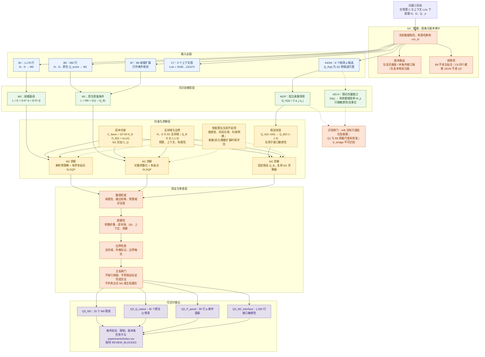

# 问题三执行架构图

状态：`REVIEW_BLOCKED`。本图描述当前可执行、可复核的条件解答路径；理论四量接口保留在图中，但不会绕过数据识别闸门进入正式联合拟合。

## 执行顺序

| 阶段 | 执行动作 | 形成的证据 | 停止条件 |
|---|---|---|---|
| G0 审计 | 冻结数据角色、剔除投毒/截断输入、登记版本 | 数据角色、哈希、run_id、版本表 | 发现来源或尺度不清时停止联合建模 |
| M0 | 用 B1 拟合 `N-D` 标度律并做预算优化 | 15 个 N-D 条件情景 | 超出支持域必须标记外推 |
| M1 | 用 B6 原生 `Q_score` 加入质量成本 | 45 个 Q 条件情景 | 不得把 `Q_score` 当成 Q1 `Q_A(p)` |
| M2/P | 对 6 个观测配比候选做离散面板 | 90 行 p 面板 | p 只作 A 侧条件标签 |
| Q2→Q3 接口 | 对 5 种映射、3 类成本、5 个上下文、3 个预算做敏感性 | 1,350 行接口矩阵 | 假设校准不能升级为实证标定 |
| 验证 | 检查有限性、哈希、预算误差、边界和参数传播 | metrics、表格哈希、稳健性摘要 | 任何失败都保持 `REVIEW_BLOCKED` |
| 封包 | 写入答案、任务卡、版本表和运行索引 | 可审查 Q3 条件解答 | Peer/Integrator 未确认前不进入正式论文结论 |

## 当前回答的范围

- 已经可以回答：规模 `N-D` 分配、原生 `Q_score` 的条件影响、预算/上下文/成本族敏感性、观测配比的条件面板。
- 可以作为理论补充：通过 `ilr(p)` 改变有效数据效率的 M3-H 形式，以及 Q2→Q3 接口的反事实敏感性。
- 仍然不能声称：A-B 跨来源联合 Loss、唯一最优配比、已经标定的 `G_bridge`、支持域外的实证全局最优。

## 回链

- 综合答复：`docs/decisions/q3-answer-package-20260926.md`
- 退阶策略：`docs/decisions/q3-fallback-solution-strategy-20260926.md`
- 版本边界：`docs/research/q3/conditional-interface-version-20260926.md`
- 任务卡：`docs/tasks/T-Q3-CONDITIONAL-INTERFACE.yml`
