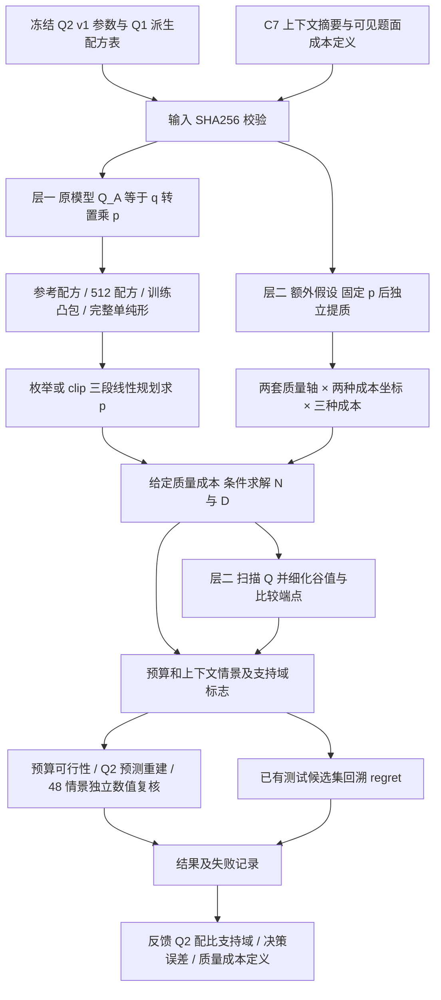

# 实验架构与问题覆盖

| 要求 | 当前覆盖 | 尚缺 |
|---|---|---|
| 建立资源优化目标与约束 | 使用冻结条件模型；显式训练、注意力、提质成本 | 直接观测验证的完整联合 Loss |
| N、D、Q、p 配置 | 原模型保留 Q—p 依赖；扩展单列独立提质假设 | 四因素独立识别、现实最优配置 |
| 预算和长上下文影响 | 3 主预算、51 点扩展预算、5 上下文；临界上下文 30000 | 长上下文的任务效益 |
| 求解与验证 | 分段 LP、条件 N/D 求根、Q 网格细化、全变量 SLSQP | 对任意目标的全局保证、新训练实验 |
| 质量处理转折 | Q_B 口径得到 30 个转折括区；Q_A 主网格到映射上限 | 确定真实成本尺度和转折数值 |
| 指导 Q2 改进 | 负 Loss、决策 regret、支持域、尺度迁移反馈 | 新模型重拟合及独立留出验证 |

运行 `q3-frozen-q2-exploration-20260925-r01` 不采用遗传算法：当前冻结模型可按结构降维。若以后引入不可分交互，需单独设计新求解及验证协议。上下文是外部场景参数；注意力/训练成本比为 Lctx/30000，不随固定上下文的预算变化。
