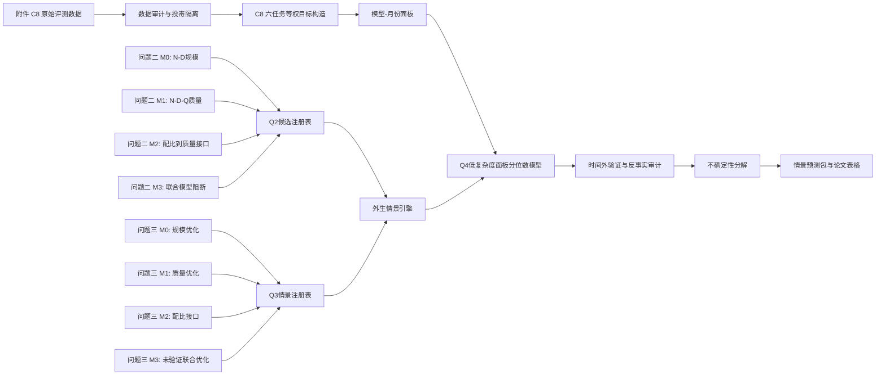

# 问题四深化实验系统架构

## 1. 系统目标与核心原则

本系统用于在短时间轴、稀疏月份和模型横截面高度不均衡的条件下，预测 C8 模型能力前沿，并评估问题二、问题三候选模型对预测结果的影响。

系统的核心原则如下：

1. **直接目标与外生约束分离。** 问题四直接预测 C8 详细六任务等权前沿；问题二、问题三只产生规模、质量、配比和算力情景。
2. **候选模型不自动产生最终结论。** 每个候选模型必须经过时间外验证、支持域检查和对抗性审计。
3. **情景不等于观测。** 问题三产生的 (N^*,D^*,Q^*,p^*) 是条件模型下的情景值，不回填为问题四训练标签。
4. **不确定性分层保存。** 样本不确定性、Q4 模型不确定性、Q2/Q3 接口不确定性和数据漂移风险分别记录。
5. **失败结果必须保留。** 负 Loss、纯 Enron 配比、高预算越界和 1B 迁移失败等结果作为拒绝证据写入审计表，不通过截断或删除隐藏。
6. **最终输出使用区间和情景。** 当候选模型结果明显分歧时，输出情景包和预测包络，不强行计算没有统计依据的模型平均值。

## 1.1 已冻结的主评价协议

根据当前问题定义，第一版正式实验采用以下协议：

| 项目 | 主协议 | 稳健性/敏感性协议 |
|---|---|---|
| 主评价指标 | 详细 C8 六任务等权分数 | 官方 `Average`、留一任务分数 |
| 预测对象 | 月度 95% 分位前沿 | q90、q99 和模型横截面 Bootstrap |
| 时间切分 | 按总时间长度顺序 70/30 切分 | 扩展窗口滚动起点 |
| 当前十个月对应切分 | 前 7 个月训练、后 3 个月测试 | 1 个月和 3 个月滚动预测 |
| 正式预测期 | 未来 12 个月 | 6 个月仅在数据长度允许时执行；12 个月回测待未来数据补齐 |
| 未来模型构成 | 2025 年参数规模和类型比例作为基准 | 合理变化的类型比例和规模分布情景 |
| 模型类型 | 全类型主分析，`Type` 作为协变量/分层变量 | pretrained-only 清洁敏感性 |
| 算力增长 | 文献锚定倍率情景 | 0% 控制情景和 50% 低增长压力测试 |
| 输出形式 | 平台型区间与趋势型区间并列 | 候选模型包络和失败情景审计 |

70/30 切分只用于当前短数据的时间外评价，不意味着 7 个月训练、3 个月测试是普适最优比例。由于主预测期为 12 个月，而当前观测轴不足以进行真实 12 个月回测，论文中必须把“短期验证”和“12 个月情景外推”分开表述。

## 2. 系统总览



系统分成六层：

| 层 | 作用 | 允许的证据角色 |
|---|---|---|
| L0 治理层 | 任务卡、版本、数据角色、毒化审计 | 元数据和审计证据 |
| L1 数据层 | 读取、清洗、去重、目标构造 | 原始观测和派生指标 |
| L2 候选层 | 注册 Q2/Q3 候选模型及边界 | 条件模型、参数、支持域 |
| L3 情景层 | 将候选模型转成算力/规模/质量情景 | 外生约束，不是训练标签 |
| L4 Q4 预测层 | 直接拟合 C8 前沿预测模型 | 主结果 |
| L5 验证与报告层 | 时间外验证、Bootstrap、失败审计、论文输出 | 接受、保留、阻断或敏感性结论 |

## 3. 证据角色和模型注册表

每个模型必须在注册表中声明以下字段：`model_id`、`source_question`、`target`、`input_role`、`support_domain`、`fit_data`、`validation_split`、`status`、`allowed_use` 和 `rejection_rule`。

### 3.1 Q4 直接预测模型

| ID | 模型 | 目标 | 用途 | 状态 |
|---|---|---|---|---|
| Q4-B0 | 最近值 | 月度 C8 q95 | 平台型基线 | 主基线 |
| Q4-B1 | 近三月均值 | 月度 C8 q95 | 平台型稳健基线 | 主基线 |
| Q4-B2 | 线性趋势 | 月度 C8 q95 | 趋势型基线 | 敏感性 |
| Q4-P90 | 面板 q90 | 单模型 C8 | 校准对照 | 候选 |
| Q4-P95 | 面板 q95 | 单模型 C8 | 主预测模型 | 主候选 |

Q4-P95 的默认形式为：

\[
Q_{\tau}(S_i)=\alpha_\tau+\beta_\tau\log(1+N_i)+\gamma_\tau t_i+\delta_{\tau,\mathrm{type}(i)}.
\]

其中 (S_i) 为详细 C8 六任务等权分数，(N_i) 为参数规模，(t_i) 为月份，`type` 为模型类型。

### 3.2 Q2 候选模型

| ID | 模型 | 主要输入 | 可以给 Q4 什么 | 禁止用途 |
|---|---|---|---|---|
| Q2-M0 | (N-D) 幂律模型 | (N,D) | 规模弹性与算力放大 | 直接预测 C8 |
| Q2-M1 | (N-D-Q_B) 条件模型 | (N,D,Q_B) | 质量改善情景 | 把 (Q_B) 当作 C8 已观测特征 |
| Q2-A | A 侧配比响应 | (p) | 配比敏感性标签 | 与 B 侧 Loss 直接相加 |
| Q2-M2 | (Q_A(p)\rightarrow Q_B) | 配比和质量接口 | 接口情景矩阵 | 视作已校准质量尺度 |
| Q2-M3 | 四量联合模型 | (N,D,Q_A(p)) | 暂无 | 进入正式主模型 |

Q2-M0 的近乎精确内部拟合只说明附件内规模结构可被拟合；由于外部迁移和联合桥接仍有限，它只能作为问题四的一个外生规模路径。

### 3.3 Q3 候选模型

| ID | 模型路径 | 允许的 Q4 输入 | 必须附带的标记 |
|---|---|---|---|
| Q3-M0 | 规模优化 | (N^*(C),D^*(C)) | B1 支持域、上下界 |
| Q3-M1 | 质量条件优化 | (N^*(C,Q),D^*(C,Q)) | Q_B 原生尺度、成本函数 |
| Q3-M2 | 配比接口情景 | (p,Q_A,Q_B) 情景 | 映射假设、未验证接口 |
| Q3-M3 | 四量联合优化 | 不进入主系统 | `BLOCKED` |

如果 Q3 输出落在 B1 支持域外、产生负 Loss、选择训练数据没有覆盖的配比方向，必须自动标记为 `REJECTED_EXTRAPOLATION`，只允许出现在失败审计中。

## 4. 数据层和数据契约

### 4.1 数据输入

主输入分为四类：

1. **C8 评测数据**：模型名、提交日期、参数规模、模型类型、六项任务分数和详细 JSON 结果；
2. **Q2 模型注册数据**：M0/M1/M2 的参数、质量尺度、支持范围和来源哈希；
3. **Q3 情景数据**：预算、上下文、(N^*,D^*,Q^*,p^*)、成本函数、可行性标记；
4. **治理数据**：任务卡、运行配置、输入哈希、环境和审计结论。

### 4.2 中间表

系统固定生成以下中间表：

| 表 | 最小字段 |
|---|---|
| `q4_panel.csv` | `model_id, month, params_b, type, base_model, model_family, namespace, train_tokens, train_compute, eval_version, IFEval, BBH, MATH, GPQA, MUSR, MMLU_PRO, c8_score` |
| `q4_monthly_frontier.csv` | `month, n_models, q90, q95, q99, bootstrap_low, bootstrap_high` |
| `candidate_registry.csv` | `model_id, source_question, target, support_domain, status, allowed_use` |
| `scenario_grid.csv` | `scenario_id, q2_model, q3_model, compute_growth, context, time_mode, support_flag` |
| `forecast_outputs.csv` | `scenario_id, horizon, q4_model, q50, q90, q95, lower, upper, violation_flag` |
| `validation_summary.csv` | `model_id, split, pinball, coverage, MAE, RMSE, bias, pseudo_r2, gate_status` |
| `failure_audit.csv` | `case_id, source, failure_type, trigger, consequence, allowed_use` |

### 4.3 数据质量门

在模型运行前必须通过：

- 六项 C8 任务指标存在且处于合法范围；
- 参数规模大于零，日期可解析；
- 同一模型—月份重复记录按预先固定的聚合规则处理；
- 2019—2023 历史记录不与 2024—2025 主窗口混合拟合；
- 官方 `Average` 与详细 C8 分数分列保存；
- 题面预填系数、隐藏文字和提示性答案不进入参数、特征或标签；
- 原始数据只通过哈希和 manifest 进入仓库，不提交详细原始附件。
- `model_family` 优先来自 `Base Model`；发布方 namespace 只作为聚类代理，不能当作已验证的模型族；
- `train_tokens`、`train_compute` 缺失时不均值填补，完整字段只用于二级完整案例分析；
- `eval_version`、榜单版本和任务协议作为字段保存；协议变化时分层或加入版本固定效应，不跨版本直接合并。

## 4.4 模型类型策略：全类型主分析与 pretrained-only 敏感性

不建议主分析只保留 pretrained。问题四的目标是公开模型榜单的能力前沿，chat、fine-tuned 和 merge 模型也是榜单前沿的组成部分；如果只保留 pretrained，会估计一个更窄的“预训练模型前沿”，与公开榜单前沿不完全一致。

主分析采用以下规则：

- **全类型主分析：**保留 pretrained、chat、fine-tuned 和 merge，使用 `Type` 作为协变量，并报告各类型的月度占比和分层 q95；
- **pretrained-only 敏感性：**检验时间趋势是否仅由后训练类型比例上升造成；
- **chat/fine-tuned：**保留在公开前沿中，但不把榜单分数变化解释为单纯预训练规模收益；
- **merge：**保留作榜单前沿分析，但在训练算力因果解释和训练轨迹分析中单列或排除，因为 merge 可能复用已有权重而没有独立的训练算力记录。

类型比例变化是问题四的关键混杂来源。若 2025 年 fine-tuned 或 merge 占比上升，整体 q95 的上升可能同时包含类型构成效应和模型能力效应。因此未来构成情景至少包括：

1. **2025 固定构成：**参数规模分布和 Type 比例均保持 2025 年；
2. **类型稳定情景：**保持 2025 年 Type 比例，但允许参数规模按算力情景放大；
3. **类型变化情景：**对 pretrained/chat/fine-tuned/merge 比例进行预先登记的小幅扰动，并报告相对于固定构成的差异。

第一版把“小幅扰动”具体化为两种可复现操作：

- **类型比例扰动：**每次将一个类型的占比改变 ±10 个百分点，再按比例重新归一化其他类型；
- **参数分布扰动：**分别保持 2025 年经验参数分布不变，或按 Q2/Q3 情景对 (log N) 的整体位置进行平移，同时保持 2025 年分布的离散度。

这两类扰动不用于声称未来真实构成，只用于测量预测对构成假设的敏感度。模型族默认保持 2025 年可观测族构成；若进行新族进入情景，必须单独标记为未观测外推。

## 5. 分阶段实验流程

### E0：实验登记与冻结

登记 `task_id=T-Q4-001`、运行编号、负责人、审阅人、代码提交、输入哈希、目标口径、预测水平和情景范围。冻结以下内容：

- 主目标：详细 C8 六任务等权分数；
- 主分位数：95%；
- 时间窗口：2024-06 至 2025-03；
- 时间外切分：按总时间长度顺序 70/30；当前十个月为前 7 个月训练、后 3 个月测试；
- 正式预测期限：12 个月；
- 稳健性期限：1 个月、3 个月，数据充分时增加 6 个月；
- 算力增长：0% 控制情景和文献锚定倍率情景；
- 时间模式：平台型、趋势型；
- Q2/Q3 仅作为外生情景。

### E1：数据审计与目标构造

输出 `q4_panel.csv`、`q4_monthly_frontier.csv` 和 `data_manifest.yaml`。完成重复、缺失、数据源、模型类型和任务级分数审计。任何毒化提示只进入 `poison_audit.md`，不进入建模流程。

### E2：滚动基线

对 Q4-B0、Q4-B1 和 Q4-B2 进行逐月一步预测。主评价为 MAE、RMSE、Bias；测试点不足时不进行显著性检验，不以单一基线的短期胜出证明长期趋势。

### E3：直接 C8 面板模型

依次拟合：

1. 截距模型；
2. 参数规模模型；
3. 参数规模 + 类型；
4. 参数规模 + 时间；
5. 参数规模 + 时间 + 类型。

每个模型同时拟合 q90 和 q95，并保存 pinball loss、覆盖率、MAE、RMSE、Bias、quantile pseudo-(R^2) 和普通测试 (R^2) 的区分结果。

### E4：时间外和分组验证

主验证采用按总长度顺序的 70/30 时间外切分。当前十个月数据对应前 7 个月训练、后 3 个月测试。附加验证包括：

- 留一模型发布方代理；
- 留一基础模型族（若字段可用）；
- 任务留一综合分数；
- 月份标签置换安慰剂；
- 训练窗口为 3 个月和 5 个月的滚动基线。

滚动预测按预测长度分层：(h=1) 和 (h=3) 作为当前数据的可执行稳健性检查；(h=6) 只有在扩展数据达到足够测试月份后执行；(h=12) 是正式情景期，不把当前资料不足造成的外推误差伪装成已完成的 12 个月回测。

模型不应只按普通 (R^2) 排名。主排序为：时间外 pinball loss → 分位覆盖率 → 支持域违规 → 辅助误差。

### E5：Q2/Q3 候选情景生成

对每个允许的 Q2/Q3 路径生成情景网格：

```text
Q2路径 × Q3路径 × 年算力增长率 × 上下文 × 时间模式 × 预测期限
```

主情景最少包含：

- Q2-M0 × Q3-M0：规模基线；
- Q2-M1 × Q3-M1：质量条件敏感性；
- Q2-M2 × Q3-M2：接口敏感性；
- 固定 2025 年模型类型构成；
- 0% 控制情景、2.3 倍/年、4 倍/年和 5 倍/年算力倍率情景；另保留 1.5 倍/年作为保守压力测试；
- 平台型和趋势型两种时间模式。

每个情景必须记录：输入模型、参数版本、支持域、成本函数、映射假设和是否越界。

### 5.1 文献锚定的算力增长情景

算力情景使用倍率而不是含义不清的“增长率”。若年倍率为 (r_C)，则百分比增长率为 (g_C=r_C-1)。第一版配置采用：

| 情景 | 年倍率 (r_C) | 百分比增长 (g_C) | 解释 |
|---|---:|---:|---|
| 控制 | 1.0 | 0% | 不改变 2025 年规模 |
| 保守压力 | 1.5 | 50% | 低于前沿历史趋势的稳健压力测试 |
| 基础设施参考 | 2.3 | 130% | 总体 AI compute stock 的文献参考情景 |
| Frontier-低 | 4.0 | 300% | 前沿训练算力约 4 倍/年的文献情景 |
| Frontier-高 | 5.0 | 400% | 前沿语言模型约 5 倍/年的文献情景 |

4—5 倍/年的数值来自对 milestone/frontier training compute 趋势的外部研究；2.3 倍/年用于表示更保守的总体算力供给情景。它们是外生压力测试，不是对 C8 榜单未来必然增长的预测。由于 12 个月预测期较短且支持域有限，所有倍率均必须经过 (N,D) 支持域检查；超出范围的情景只进入外推审计。

### E6：情景输入到 Q4 预测

情景引擎只改变 Q4 模型的条件输入，不改变 Q4 的训练标签。伪代码如下：

```text
for q2_model in allowed_q2_models:
    for q3_model in allowed_q3_models:
        scenario = generate_external_scenario(q2_model, q3_model)
        if scenario.support_flag != "PASS":
            save_failure_audit(scenario)
            continue
        for time_mode in [platform, trend]:
            for horizon in [12, 24]:
                forecast = q4_panel_quantile.predict(
                    params=scenario.N_star,
                    type_profile=scenario.type_profile,
                    time_mode=time_mode,
                    horizon=horizon
                )
                check_monotonicity_and_bounds(forecast)
                save_forecast(forecast)
```

### E7：多层不确定性

不确定性分四层计算：

1. **横截面样本不确定性**：按月份对模型重采样，得到 q95 Bootstrap 区间；
2. **Q4 模型不确定性**：发布方或模型族 cluster Bootstrap，重新拟合面板分位数模型；
3. **Q2/Q3 候选不确定性**：比较 M0/M1/M2、质量成本和支持域设定；
4. **数据漂移风险**：评测规则、数据源、模型类型构成和任务权重变化的压力测试。

不把四层区间简单相加。系统同时输出：

- 每一候选路径的条件区间；
- 所有通过情景的预测包络；
- 因假设变化产生的区间宽度分解。

### E8：综合报告与论文输出

最终报告至少包含：

- 主模型和截距基线的时间外比较；
- 平台型、趋势型、算力约束型情景表；
- Q2/Q3 候选模型敏感性矩阵；
- 六个任务的单任务前沿和留一任务结果；
- 失败情景审计；
- 支持域、数据漂移和外部弹性假设的边界说明。

## 6. 模型接受与拒绝规则

这些规则在运行前登记，不根据结果临时修改。

### 6.1 Q4 主模型接受门

一个 Q4 候选模型进入主结果，必须同时满足：

1. 时间外 pinball loss 低于截距基线；
2. 95% 分位经验覆盖率接近目标水平，建议预注册容忍区间为 92%—98%；
3. 不产生非法分数、负预测或支持域外未标记输入；
4. 在至少一种分组或任务敏感性检查中没有完全反转主要结论；
5. 结果能由固定配置和 manifest 复现。

若只满足第 1 条而不满足覆盖率要求，只能作为点预测候选，不能作为 q95 主模型。

### 6.2 Q2/Q3 情景拒绝门

以下情景不得进入主预测包络：

- Q1 `0–100` 分数未经校准直接当作 Q2 `0.1–1.0`；
- A-B 没有连接键却构造联合 Loss；
- Q3 完整单纯形选择训练数据未覆盖方向；
- 产生负 Loss；
- (N,D) 超过支持域且没有外推标志；
- 把 Q3 预测配置当成真实训练观测；
- 将问题二、三的探索性候选结果写成因果结论。

被拒绝的情景仍保留在 `failure_audit.csv`，用于说明模型边界。

## 7. 预设比较矩阵

| 比较维度 | 主结果 | 敏感性 1 | 敏感性 2 |
|---|---|---|---|
| C8 目标 | 详细六任务等权 | 官方 Average | 留一任务等权 |
| Q4 模型 | q95 完整面板 | q90 完整面板 | 参数规模模型 |
| Q2 输入 | M0 | M1 | M2 |
| Q3 输入 | M0 | M1 | M2 |
| 时间模式 | 平台/趋势并列 | 仅平台 | 仅趋势 |
| 算力增长 | 1.0/1.5/2.3/4.0/5.0 倍 | 1.0/1.5/2.3 倍 | 外部给定区间 |
| 类型构成 | 2025 固定 | pretrained-only | 类型比例扰动 |
| 样本来源 | 全类型 | 仅 pretrained | full-case 数据子集 |
| 附加特征 | 模型族、评测版本 | 模型族 | 训练数据量、训练算力 |
| 聚类单位 | 发布方代理 | 基础模型族 | 无聚类描述性 |

比较结果不采用“总分选优”。最终选择依据是：证据角色是否正确、时间外预测是否可校准、是否有支持域违规、是否能解释主要敏感性来源。

## 8. 输出目录和复现接口

建议在仓库中维护如下目录：

```text
experiments/runs/q4-system-YYYYMMDD-r01/
├── README.md
├── config.yaml
├── command.txt
├── environment.txt
├── git_commit.txt
├── data_manifest.yaml
├── candidate_registry.csv
├── scenario_grid.csv
├── validation_summary.csv
├── failure_audit.csv
├── artifacts/
│   ├── target/
│   ├── baseline/
│   ├── panel/
│   ├── scenarios/
│   ├── bootstrap/
│   └── figures/
└── reports/
    ├── data_audit.md
    ├── validation.md
    ├── scenario_sensitivity.md
    └── final_q4_results.md
```

推荐的单入口命令为：

```powershell
python scripts/q4/run_system.py `
  --data-dir data/origin/C_efficiency_evolution `
  --q2-registry configs/q4_q2_candidates.yaml `
  --q3-registry configs/q4_q3_candidates.yaml `
  --config configs/q4_system.yaml `
  --run-id q4-system-20260926-r01
```

该入口必须先执行数据审计，再执行目标构造、基线、面板模型、情景生成、验证和报告；任一数据门或模型门失败时，应停止后续主结果生成，但仍保存失败 artifact。

## 9. 当前实施顺序

### 第一阶段：先完成可复现主链

1. 已用 `scripts/q4/run_all.py` 和 `scripts/q4/q4_protocol_experiment.py` 完成可复现主链；`run_system.py` 仍是后续工程化入口；
2. 候选模型注册表保留在本架构中，当前主运行先固定 Q4 直接 C8 模型；
3. 已固定 Q2-M0/Q3-M0 为第一版规模情景；
4. 当前主模型采用 70/30 月份验证，正式预测期为 12 个月；
5. 已生成 1.0×/1.5×/2.3×/4.0×/5.0×下的平台型与趋势型 12 个月表格，旧版 12/24 个月表格只作历史探索。

### 第二阶段：加入候选模型敏感性

1. 接入 Q2-M1 和 Q3-M1；
2. 对质量成本、质量尺度和支持域做显式网格；
3. 对 Q2-M2/Q3-M2 只生成接口敏感性，不进入主模型；
4. 计算每一候选路径相对于 Q4-M0 的预测差异。

### 第三阶段：稳健性与论文闭环

1. 发布方代理 cluster Bootstrap 已完成；仍需用 parquet 的 `Base Model` 做真正的模型族留出；
2. 运行任务留一、月份置换和窗口敏感性；
3. 生成预测包络和不确定性分解图；
4. 更新论文中的方法、结果和限制；
5. 由非负责人审阅后再决定是否进入正式答案。

## 10. 预期科学结论的边界

该系统可以回答：

- 哪些变量对 C8 前沿具有预测信息；
- 不同 Q2/Q3 候选路径会把 Q4 预测推向何处；
- 预测结果对算力、质量、配比、模型类型和时间项有多敏感；
- 哪些情景超出了观测支持域。

该系统不能单独回答：

- 时间趋势是否就是纯技术进步；
- 算力增长是否因果地提高 C8；
- Q1 配比质量是否已被 B/C8 真实验证；
- 哪个未观测模型配置一定是未来最优。

因此，问题四最终应形成的是一个**经时间外验证的条件前沿预测系统**，而不是把前面问题的探索性模型拼接成一个未经验证的联合定律。

## 11. 算力情景的外部依据

第一版配置不把外部文献的算力趋势当作问题四的观测结果，而是将其作为情景网格的来源。当前采用的参考包括：

- Sevilla 等对机器学习训练算力历史趋势的研究，报告深度学习时期训练算力约每 6 个月翻倍；
- Epoch AI 对 2010—2024 年 notable/frontier 模型的更新分析，报告近期训练算力约 4—5 倍/年，并给出较宽的不确定性；
- Epoch AI 对 frontier language model 的趋势汇总，报告 2020 年以来约 5 倍/年的训练算力增长，同时给出约 4—6 倍/年的区间。

这些来源的对象、样本筛选和时间范围与 C8 榜单不完全相同，因此本文只把它们用于选择外生压力测试的倍率，不用于证明 C8 分数会按同一倍率增长。正式论文中应在参考文献表中保留来源、访问日期和情景转换公式。
