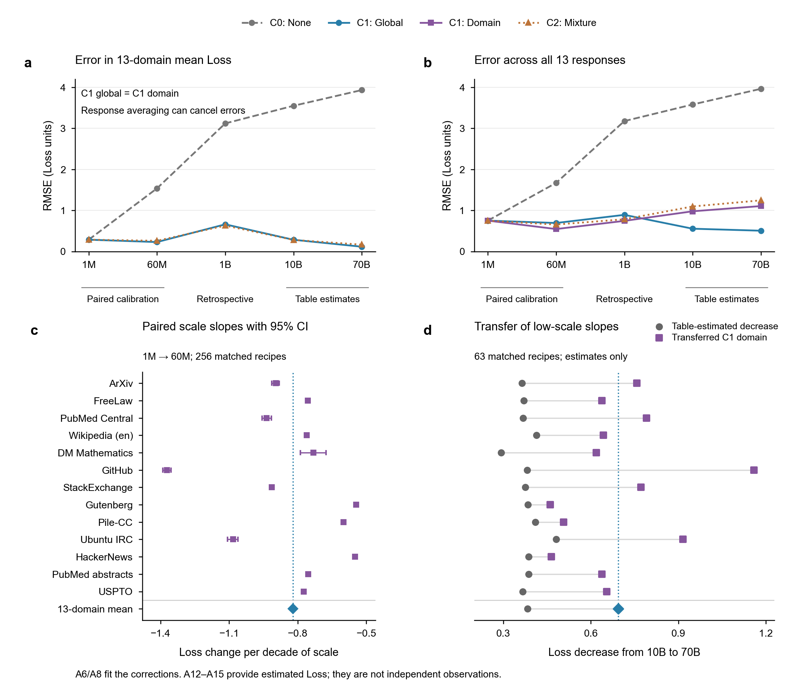

# 尺度校准交接复核

运行：`q1-s03-handoff-audit-20260925-r01`；任务：`T-Q1-S03-HANDOFF`；状态：PEER_REVIEW。

该运行复核本地 B1/M1 与 C1/C2 的公式、参数和指标，补齐逐域误差。不是重新宣布全团队最优模型。现有团队的二阶 Ridge、ilr、GBDT 和质量部分映射等研究见 [统一索引](../../../docs/problem/q1-s03-team-model-inventory.md)。

## 数据及重现

输入为主仓库已有的 `experiments/runs/quality-mapping-20260925-r02-soft-handoff/tables/scored_wide_v1_hard.csv`，SHA256 `c0714f8594ea8e9e0072b80ab156dd71293489ac436a9856f81dd64d9eb5d44b`。本地历史组合表与本输入逐单元一致，哈希差异来自换行形式；两个字节版本均记录在 manifest。1,214 行、17 配比、13 响应；A6=A8、A12=A14、A12为A4前63配方均复核通过。5个无映射训练行仅在 mapped 分支排除。

基模型仅用 A4/A5；C1/C2 用 A6/A8 配对数据校准。λ为历史值：proxy M1=100，mapped M1=10。C2 的 λ在配对五折内选择（当前λ=10），预处理严格拟合于训练折；调参分数不当作嵌套泛化分数。

## 平均响应与全部域指标

下面均是 **B1_Q_proxy**。`rmse_mean_loss/mae_mean_loss` 对每行13域平均响应计算；`rmse_pooled_all_domains/mae_domain_macro` 在全部行与域上计算（完整响应时MAE的域均值等于pooled MAE）。每个数值用全部对应行；没有筛选有利域。

| correction             | dataset         |   rmse_mean_loss |   mae_mean_loss |   rmse_pooled_all_domains |   mae_domain_macro |
|:-----------------------|:----------------|-----------------:|----------------:|--------------------------:|-------------------:|
| C0_none                | A6/A7 1M        |         0.285591 |        0.226893 |                  0.750656 |           0.592219 |
| C0_none                | A8/A9 60M       |         1.536796 |        1.521036 |                  1.670258 |           1.523685 |
| C0_none                | A10/A11 1B      |         3.120606 |        3.120193 |                  3.177545 |           3.120193 |
| C0_none                | A12/A13 10B估算 |         3.550306 |        3.548973 |                  3.581985 |           3.548973 |
| C0_none                | A14/A15 70B估算 |         3.933304 |        3.931886 |                  3.963893 |           3.931886 |
| C1_global              | A6/A7 1M        |         0.285591 |        0.226893 |                  0.750656 |           0.592219 |
| C1_global              | A8/A9 60M       |         0.228022 |        0.180521 |                  0.692831 |           0.555454 |
| C1_global              | A10/A11 1B      |         0.659979 |        0.658022 |                  0.891167 |           0.724572 |
| C1_global              | A12/A13 10B估算 |         0.283304 |        0.266078 |                  0.553360 |           0.444779 |
| C1_global              | A14/A15 70B估算 |         0.114652 |        0.097716 |                  0.504692 |           0.365342 |
| C1_domain              | A6/A7 1M        |         0.285591 |        0.226893 |                  0.750656 |           0.592219 |
| C1_domain              | A8/A9 60M       |         0.228022 |        0.180521 |                  0.544823 |           0.446685 |
| C1_domain              | A10/A11 1B      |         0.659979 |        0.658022 |                  0.744434 |           0.675300 |
| C1_domain              | A12/A13 10B估算 |         0.283304 |        0.266078 |                  0.977921 |           0.771935 |
| C1_domain              | A14/A15 70B估算 |         0.114652 |        0.097716 |                  1.105318 |           0.855625 |
| C2_mixture_conditioned | A6/A7 1M        |         0.285591 |        0.226893 |                  0.750656 |           0.592219 |
| C2_mixture_conditioned | A8/A9 60M       |         0.258803 |        0.204856 |                  0.654461 |           0.513951 |
| C2_mixture_conditioned | A10/A11 1B      |         0.629636 |        0.622053 |                  0.783636 |           0.686490 |
| C2_mixture_conditioned | A12/A13 10B估算 |         0.280392 |        0.247786 |                  1.095793 |           0.893842 |
| C2_mixture_conditioned | A14/A15 70B估算 |         0.164152 |        0.136261 |                  1.245192 |           0.978255 |

核心含义：简单规模平移能明显降低平均偏差；但 C1_global 与 C1_domain 的平均Loss指标相同，不代表逐域指标相同。70B 上 C1_global 的 pooled RMSE 为0.504692，C1_domain为1.105318，均不能用平均Loss RMSE的0.114652代替。校准外误差仍显著，不能只汇报相对降幅。

## 修正的单位与敏感性

平均斜率为 `-0.820723652`，配对行 bootstrap 95%区间 `[-0.826699359, -0.814808031]`。这不是预测区间，也不包含尺度函数选择的不确定性。

旧 C2 将完整1M→60M差值误当成每个十倍规模斜率。本次统一为 `delta_hat(p)*log10(S/1M)/log10(60)`。修复后平均Loss RMSE在1B约0.6296、10B约0.2804、70B约0.1642，不再支持旧的“灾难性外推失败”判断。C3暂不沿用其有泄漏的旧混合调参结果。

Q_proxy/Q_mapped的C1_global对照见 `table_quality_sensitivity.csv`。这只是v1质量轴敏感性，不是对团队canonical TOPSIS或v2软映射完成兼容性验证。

## 高规模区间的形状检查

| correction             |   n |   reference_delta_mean |   predicted_delta_mean |     rmse |      mae |
|:-----------------------|----:|-----------------------:|-----------------------:|---------:|---------:|
| C1_global              |  63 |              -0.382913 |              -0.693592 | 0.311107 | 0.310679 |
| C1_domain              |  63 |              -0.382913 |              -0.693592 | 0.311107 | 0.310679 |
| C2_mixture_conditioned |  63 |              -0.382913 |              -0.697465 | 0.315502 | 0.314552 |

表中差值为70B减10B；提供的估算表下降约0.382913，C1预测下降约0.693592。即使绝对均值误差下降，固定对数斜率也不能准确解释高规模区间增量。此结论与团队已有尺度迁移审计方向一致；不把表估算值提升成实测规律。

## 证据边界与选择建议

- A8是校准内；A10是已多次查看的校准外回顾评价；A12/A14为已见配方的估算尺度外推。
- RMSE、MAE作为主指标，R²和Spearman保留诊断。负R²表示差于该表均值参照；C1固定尺度平移不会改善排序。
- 若只关注平均Loss预测，本地B1+C1是简洁工程候选；若任务关注逐域或组合效果，必须同时看逐域、pooled结果及团队配比模型，不能由前者代替后者。
- 该包没有新拟合二阶交互。团队已有二阶与替代效应证据见索引。新实验应另立预先明确的协议，不能继续以本次已查看表反复调参并称独立验证。

## 文件与图

- `metrics_aggregate.csv`：96行模型×修正×数据集结果。
- `metrics_by_domain.csv`：13域逐域结果。
- `model_parameters.json`：所有基模型、C2、变换和校准参数。
- `paired_correction_cv.csv`：配对折内调参分数。
- `scale_coefficients.csv`：逐域及平均斜率区间。
- `paired_shift_transfer.csv`：校准及高规模区间变化审计。
- `audit.json`：环境、数据结构、数据角色与局限。
- [图形及图注](figures/README.md)：新的口径对照图；旧版前瞻标签图不作为本包证据。

