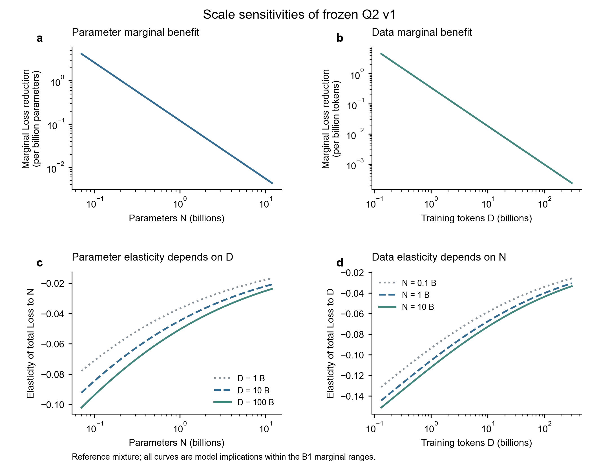
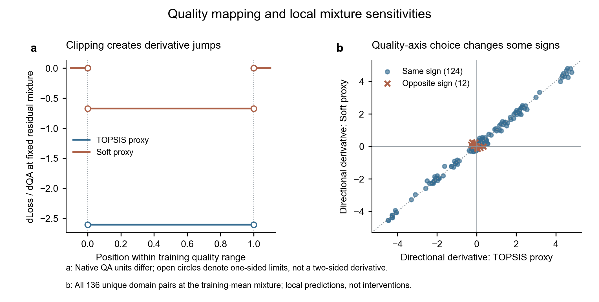

# E1：边际效用与弹性

状态：**RUN_COMPLETE / REVIEW_REQUIRED**。这是冻结v1的解析、数值及结构敏感性分析，不增加真实实验观测，也不构成完整A—B联合验证。

入口：[完整结果报告](report.md) · [执行方案](../../../docs/research/q2/E1-plan.md) · [机器指标](metrics.json) · [输入与环境](manifest.json) · [数值核验](verification_checks.csv) · [图形QA](figures/QA.md)

参考点N=1 B、D=100 B、A4训练平均配方下，预测Loss为2.385578，N和D的完整Loss弹性分别为−0.050447、−0.040100。规模收益递减得到数值核验；质量轴切换使136个无序领域对中的12个方向改变。以上都是模型条件结论。

## 复现

在仓库根目录运行：

```powershell
python -m pip install -r requirements-q2-e1.txt
python scripts/q2_e1_marginal_elasticity.py --output-dir "../q2-e1-rerun"
python scripts/plot_q2_e1.py --run-dir "../q2-e1-rerun"
python scripts/q2_verify_e1.py --rerun-dir "../q2-e1-rerun"
```

不需要受控原始附件；读取已发布的冻结参数、配方特征和既有折参数。脚本不使用桥接表中的观测Loss列来拟合或选择模型。

数值表采用固定配置生成；11张数值CSV在独立目录再次运行后字节一致。PDF/SVG的创建时间等元数据可能变化，因此重跑核对以数值表为主。图源CSV、脚本及SVG/PDF/PNG均已发布。

## 图




