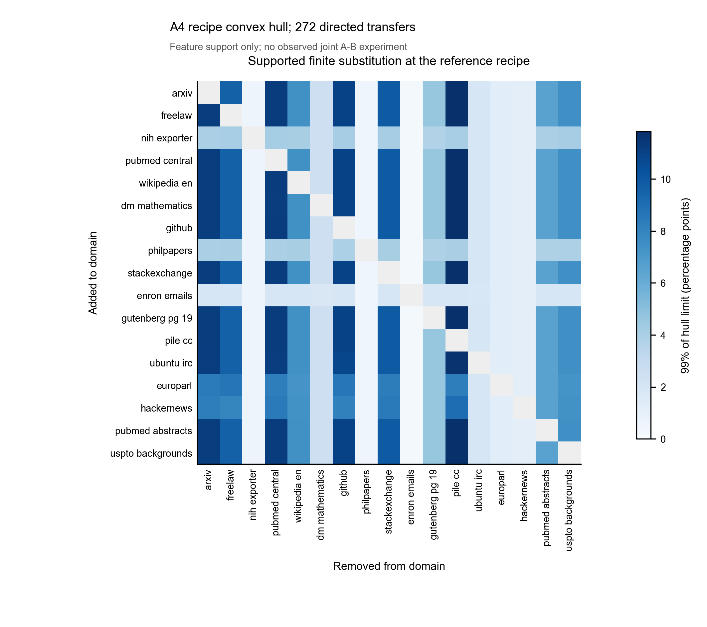
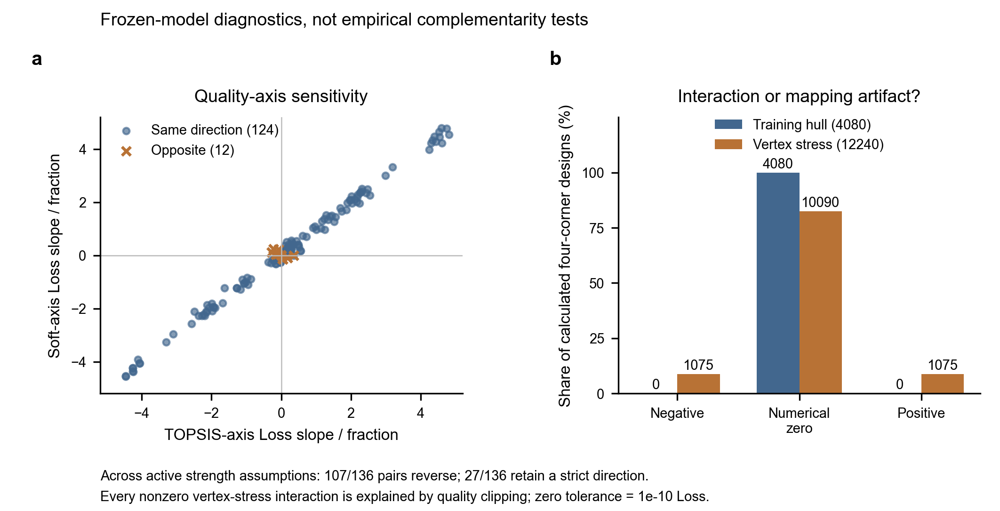

# E2：领域替代与互补条件分析

task_id: T-Q2-E2。计算 RUN_COMPLETE；交付 **REVIEW_BLOCKED**。

[结果报告](report.md) · [配置与哈希](manifest.json) · [数据字典](data_dictionary.md) · [执行前方案](../../../docs/research/q2/E2-plan.md) · [交接](../../../docs/tasks/T-Q2-E2-handoff.md)

272个方向均支持0.1个百分点替代，224个支持1个百分点；4080个凸包内四角计算的交互差为数值零，反映仿射结构。真实互补尚不可识别。

```powershell
python -m pip install -r requirements-q2-e2.txt
python scripts/q2_e2_domain_substitution.py --output-dir "../q2-e2-rerun"
python scripts/q2_verify_e2.py --rerun-dir "../q2-e2-rerun"
python scripts/plot_q2_e2.py --run-dir "../q2-e2-rerun"
python scripts/q2_verify_delivery.py
```





10张数值CSV与第二次运行字节相同；绘图文件中的时间元数据可能不同。原始附件不需要，观测Loss列不读取。
