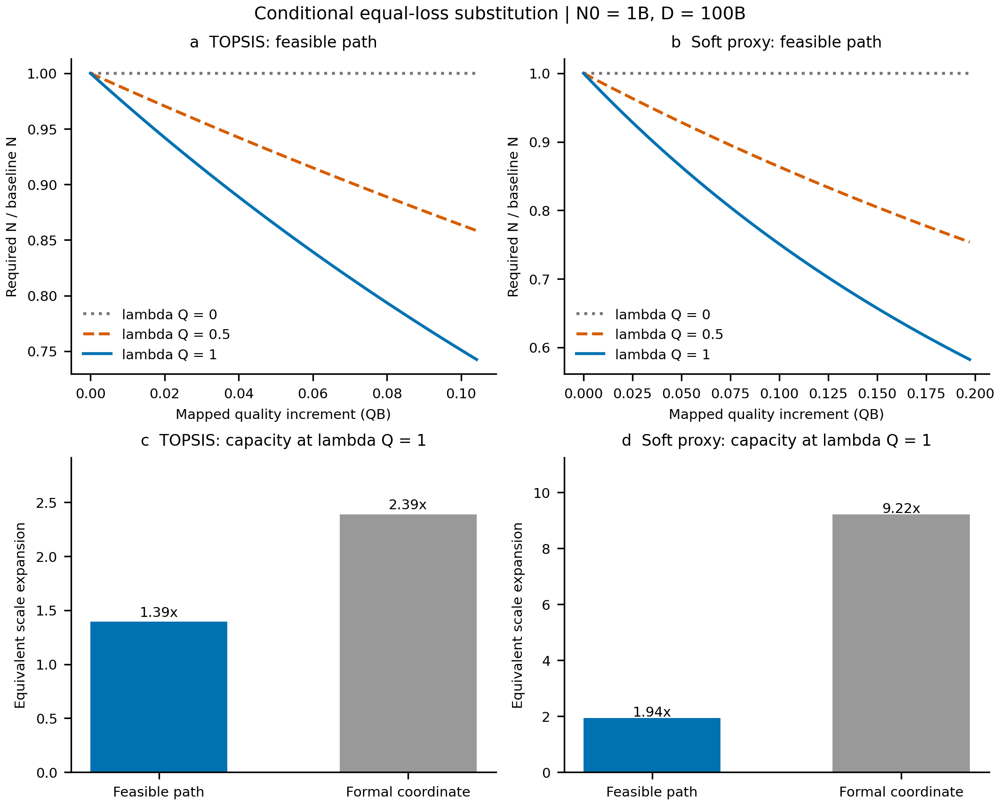
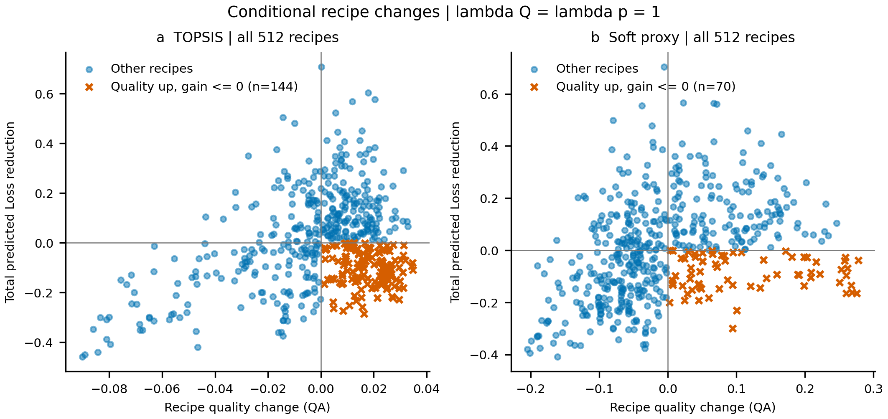

# E3：质量与参数的等Loss替代

task_id: T-Q2-E3。计算 RUN_COMPLETE；交付 REVIEW_BLOCKED。

[报告](report.md) · [数据字典](data_dictionary.md) · [运行manifest](manifest.json) · [预登记](../../../docs/research/q2/E3-plan.md)

在1B参数/100B token、λQ=1条件下，安全路径的参数需求为原来的74.3%（TOPSIS）和58.2%（soft），属于条件预测，未获联合观测验证。

复现命令（仓库根目录）：

    python -m pip install -r requirements-q2-e3.txt
    python scripts/q2_e3_quality_substitution.py --output-dir ../q2-e3-rerun
    python scripts/q2_verify_e3.py --rerun-dir ../q2-e3-rerun
    python scripts/plot_q2_e3.py --run-dir ../q2-e3-rerun
    python scripts/q2_verify_delivery.py

9张CSV和metrics重跑字节一致；图像可含不同生成时间元数据。实际环境版本见environment.json。

