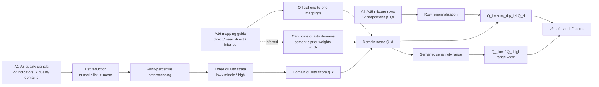

# Soft mapping process architecture

```mermaid
flowchart LR
    A123["A1-A3 quality signals<br/>22 indicators, 7 quality domains"] --> PRE["List reduction<br/>numeric list -> mean"] --> NORM["Rank-percentile preprocessing"] --> CLUST["Three quality strata<br/>low / middle / high"] --> QD["Domain quality score q_k"]
    A16["A16 mapping guide<br/>direct / near_direct / inferred"] --> OFF["Official one-to-one mappings"] --> QM["Domain score Q_d"]
    A16 -. inferred .-> INF["Candidate quality domains<br/>semantic prior weights w_dk"] --> QM
    QD --> QM
    P["A4-A15 mixture rows<br/>17 proportions p_i,d"] --> RENORM["Row renormalization"] --> QROW["Q_i = sum_d p_i,d Q_d"]
    QM --> QROW
    QM --> RANGE["Semantic sensitivity range"]
    RANGE --> UNC["Q_i,low / Q_i,high<br/>range width"]
    QROW --> OUT["v2 soft handoff tables"]
    UNC --> OUT
```

Solid edges are official or observed processing steps. Dashed edges are inferred semantic priors.
