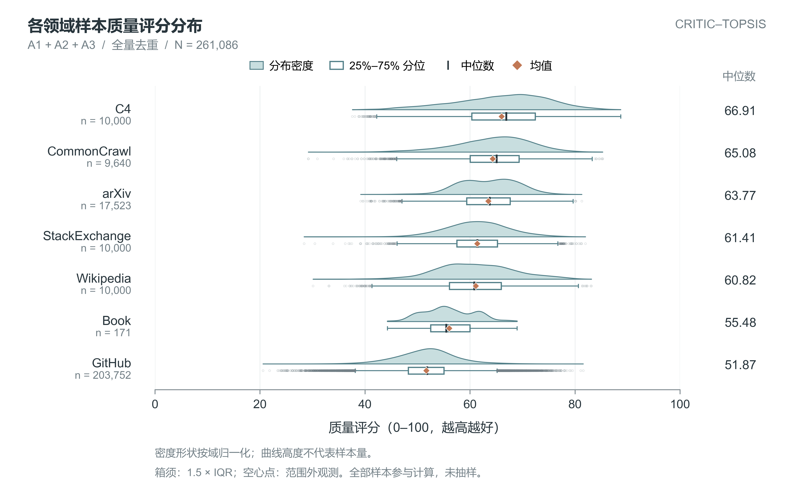
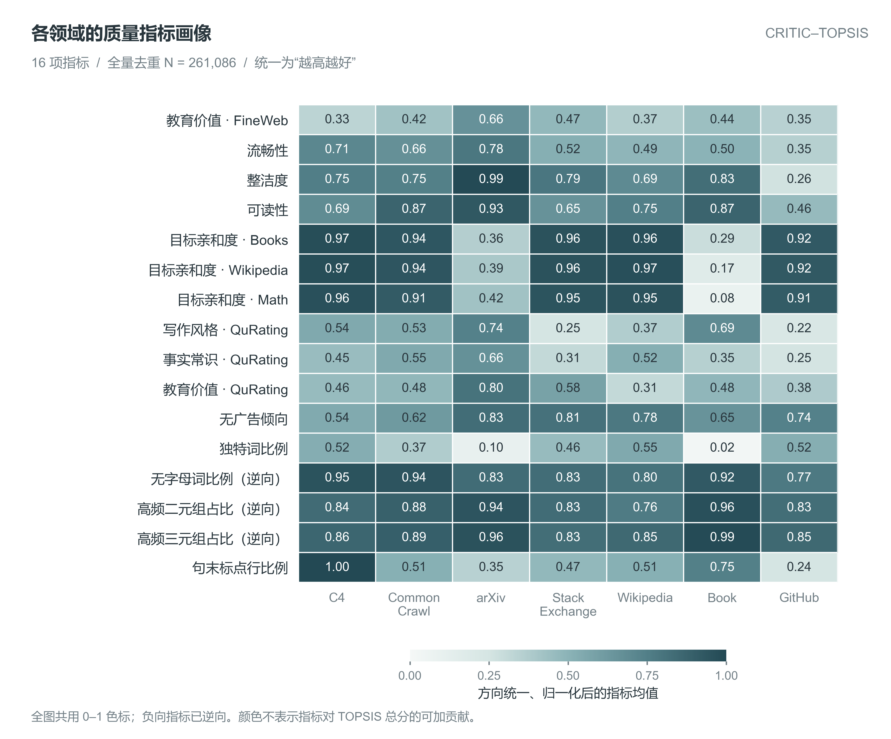
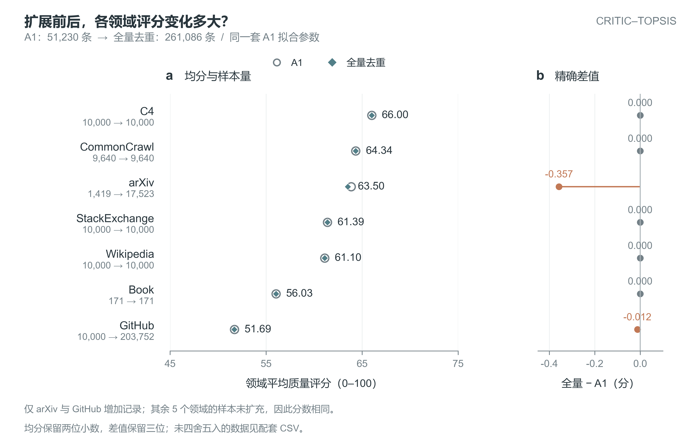
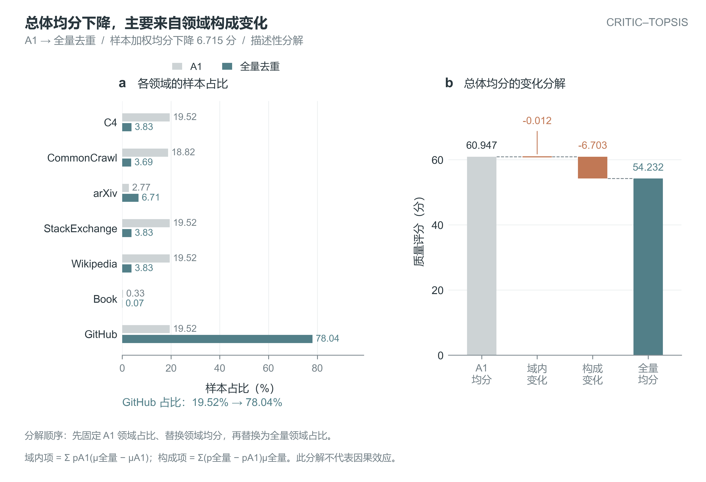
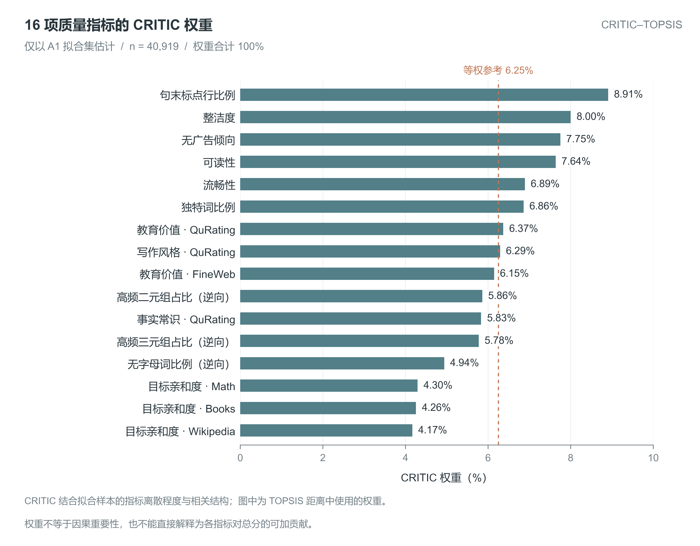
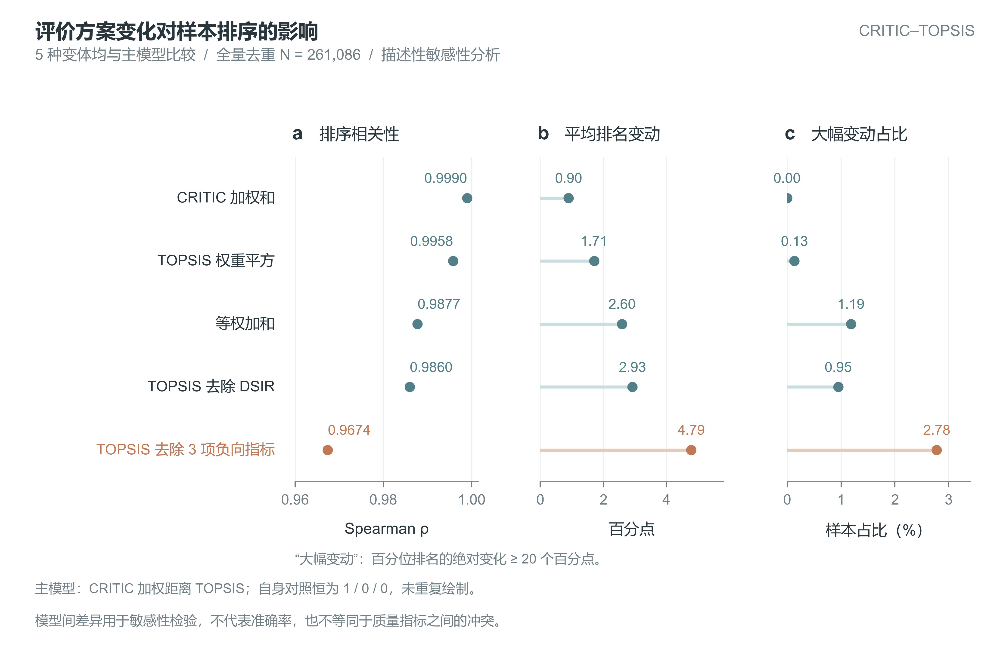

# Q1 质量评价：六张统一风格图

写作素材入口。图 1 保留已确认的 Nature 风格版本，图 2–6 使用相同配色、字体和视觉规范；图 3 已重绘。

来源运行：`q1-critic-topsis-20260924-r01`；汇总 272,505 条文件记录、261,086 个去重样本。绘图不重拟合模型。

**状态：DRAFT / 待团队审核。** #12 的代码交付已合并，但源运行的 G1 与独立审核记录仍未签署；图表上传不提升证据等级。本目录可用于写作准备，正式纳入正文按团队验收流程处理。

| 图 | 内容 | 预览 | LaTeX/矢量 | 可编辑 |
|---|---|---|---|---|
| 1 | 各领域样本质量评分分布 | [PNG](figure01_domain_distribution_nature.png) | [PDF](figure01_domain_distribution_nature.pdf) | [SVG](figure01_domain_distribution_nature.svg) |
| 2 | 各领域质量指标画像 | [PNG](figure02_indicator_heatmap_nature.png) | [PDF](figure02_indicator_heatmap_nature.pdf) | [SVG](figure02_indicator_heatmap_nature.svg) |
| 3 | A1 与全量领域评分对照（重绘） | [PNG](figure03_A1_full_comparison_nature.png) | [PDF](figure03_A1_full_comparison_nature.pdf) | [SVG](figure03_A1_full_comparison_nature.svg) |
| 4 | 领域构成与总体均分分解 | [PNG](figure04_composition_decomposition_nature.png) | [PDF](figure04_composition_decomposition_nature.pdf) | [SVG](figure04_composition_decomposition_nature.svg) |
| 5 | CRITIC 指标权重 | [PNG](figure05_critic_weights_nature.png) | [PDF](figure05_critic_weights_nature.pdf) | [SVG](figure05_critic_weights_nature.svg) |
| 6 | 评价方案排序敏感性 | [PNG](figure06_model_sensitivity_nature.png) | [PDF](figure06_model_sensitivity_nature.pdf) | [SVG](figure06_model_sensitivity_nature.svg) |

## 图注、数据和复现

- [完整中文图注与阅读说明](captions.md)
- [LaTeX 引图片段（从 paper/ 编译）](include_figures.tex)
- [图表源数据、验证与清单](../../../../experiments/runs/q1-critic-topsis-20260924-r01/figure_sources/nature-v1/README.md)
- [交接与审核路由](../../../../docs/tasks/WP-B-figures-handoff.yml)
- [论文主张回链](../../../claim-ledger.csv)

PNG 为 600 dpi，PDF/SVG 为可编辑矢量输出；图 1 的密集尾部点是栅格层。各图宽 183 mm，最小字体 7 pt，排版时优先按正文宽度插入 PDF。TIFF 及本地 ZIP 未重复纳入 Git。

图 2 使用全图统一 0–1 色标。图 3 保留所有 7 个领域，仅 arXiv/GitHub 增加记录。图 4 为指定替换顺序下的描述性分解。图 5 权重不等于因果重要性。图 6 是方案敏感性，不是指标冲突或准确率比较。

旧实验目录中的 domain_quality_comparison.* 保留为运行历史，写作候选使用本目录的 figure03_A1_full_comparison_nature.*。

## 图组预览

### 图 1：各领域样本质量评分分布

### 图 2：各领域质量指标画像

### 图 3：A1 与全量领域评分对照（重绘）

### 图 4：领域构成与总体均分分解

### 图 5：CRITIC 指标权重

### 图 6：评价方案排序敏感性

